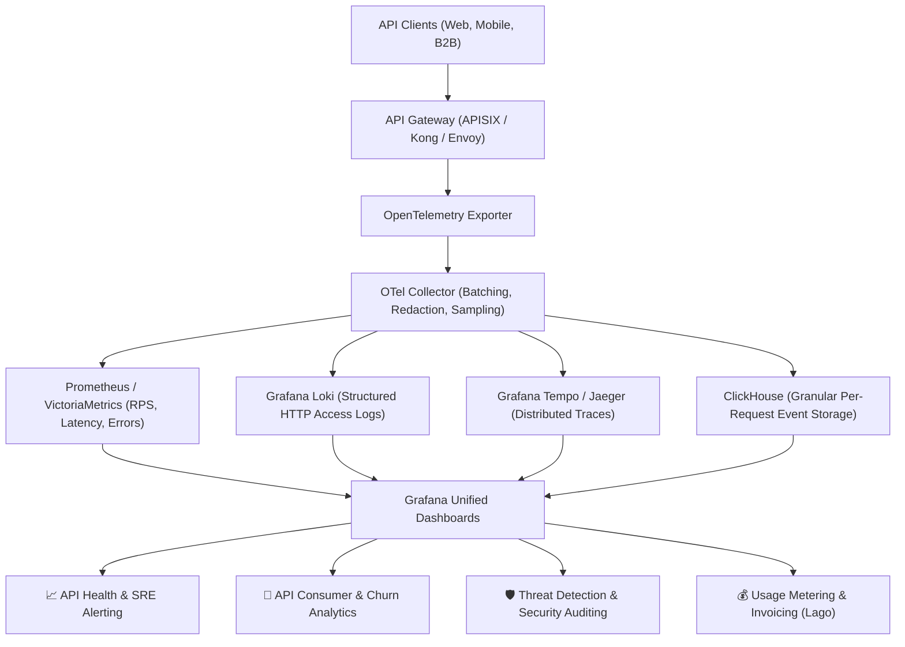

# 📊 Awesome-API-Analytics

<p align="center">
  
</p>

<p align="center">
  <a href="https://github.com/ishandutta2007/Awesome-Awesome-Awesome"></a><a href="https://discord.gg/jc4xtF58Ve"></a>
  <a href="https://github.com/ishandutta2007/Awesome-API-Analytics/stargazers"></a>
  <a href="https://github.com/ishandutta2007/Awesome-API-Analytics/network/members"></a>
  <a href="https://github.com/ishandutta2007/Awesome-API-Analytics/blob/main/LICENSE"></a>
  <a href="https://github.com/ishandutta2007"></a>
</p>

---

# 🚀 Top API Analytics & Open-Source API Observability 🌐

> 🔍 A battle-tested, curated index of **API analytics platforms, API observability engines, API monitoring systems, API management gateways, and open-source software** engineered for tracking API traffic, consumer behavior, latency percentiles, reliability metrics, security anomalies, and monetization telemetry.

---

### 💡 What is API Analytics?

**API analytics** bridges the intersection of **API infrastructure, distributed systems observability, and product analytics**. Modern cloud-native engineering teams utilize API analytics to unlock granular visibility across:

* 📡 **API Traffic & Throughput:** Requests per second (RPS), total bandwidth, payload payloads, and data throughput
* ⏱️ **Latency & Performance:** p50, p90, p95, p99 response times, TTFB (Time to First Byte), and slow endpoint identification
* 🚨 **Error Rates & HTTP Status:** 2xx success rates, 3xx redirects, 4xx client anomalies, and 5xx server failures
* 👥 **API Consumers & Developer Usage:** Active client applications, API token attribution, and user retention
* 🗺️ **Geographic & Edge Telemetry:** Regional request origin, CDN cache hit ratios, and ISP routing behavior
* 🔬 **Distributed Tracing & Logs:** Correlation across microservices using W3C Trace Context and OpenTelemetry spans
* 🛡️ **API Security & Governance:** Automated token abuse discovery, schema violations, credential stuffing, and OWASP API Top 10 mitigation
* 💰 **API Monetization & Metering:** Granular usage-based billing metrics, subscription quotas, and revenue attribution

---

```text
       API Gateway (APISIX / Kong / Envoy / Traefik)
                             │
                             ▼
                        API Traffic
                             │
       ┌─────────────────────┼─────────────────────┐
       ▼                     ▼                     ▼
 Metrics (Prometheus)   Logs (Loki)        Traces (Tempo/Jaeger)
       │                     │                     │
       └─────────────────────┼─────────────────────┘
                             │
                             ▼
            Consumer & Business Analytics (ClickHouse)
                             │
                             ▼
             Unified API Analytics Dashboard (Grafana)
```

The open-source ecosystem is particularly formidable when telemetry is unified under vendor-neutral standards:

```text
 OpenTelemetry SDKs + OTel Collector + Prometheus + Grafana + Loki + Tempo + ClickHouse + Open API Gateway
                                    =
                  Modern Open-Source API Analytics Stack
```

---

## 📑 Table of Contents

* [☁️ SaaS/Hosted Platforms](#️-saashosted-platforms)
* [🌍 Open-Source Ecosystem](#-open-source-ecosystem)
* [🚪 Open-Source API Gateways](#-open-source-api-gateways)
* [📊 Open-Source Metrics & Dashboards](#-open-source-metrics--dashboards)
* [📝 Open-Source API Logging](#-open-source-api-logging)
* [🔍 Open-Source Distributed Tracing](#-open-source-distributed-tracing)
* [🗄️ Open-Source Analytics Databases](#️-open-source-analytics-databases)
* [🔎 Open-Source API Discovery & Catalog](#-open-source-api-discovery--catalog)
* [🛡️ Open-Source API Security Analytics](#️-open-source-api-security-analytics)
* [💰 Open-Source API Monetization Analytics](#-open-source-api-monetization-analytics)
* [📈 Open-Source API Analytics Platforms (Spotlight)](#-open-source-api-analytics-platforms-spotlight)
* [📡 OpenTelemetry API Observability Architecture](#-opentelemetry-api-observability-architecture)
* [🧩 Commercial Platform → Open-Source Equivalent](#-commercial-platform--open-source-equivalent)
* [🏗️ API Analytics Architecture](#️-api-analytics-architecture)
* [🔄 Open-Source API Observability Architecture Diagram](#-open-source-api-observability-architecture-diagram)
* [📊 API Analytics Pipeline](#-api-analytics-pipeline)
* [👤 API Consumer Analytics](#-api-consumer-analytics)
* [⚖️ Commercial vs Open-Source Comparison](#️-commercial-vs-open-source-comparison)
* [📊 Commercial Platform Capabilities Matrix](#-commercial-platform-capabilities-matrix)
* [🚀 Recommended Open-Source Stacks](#-recommended-open-source-stacks)
* [📈 Key API Analytics Metrics](#-key-api-analytics-metrics)
* [🎯 Recommended Projects by Use Case](#-recommended-projects-by-use-case)
* [🏢 Building a Moesif Alternative](#-building-a-moesif-alternative)
* [🏗️ Building a Treblle Alternative](#️-building-a-treblle-alternative)
* [🔥 Building an Apigee Alternative](#-building-an-apigee-alternative)
* [🌐 Open-Source API Analytics Landscape](#-open-source-api-analytics-landscape)
* [🧠 Why Open-Source API Analytics Matters](#-why-open-source-api-analytics-matters)
* [🌟 Star History](#-star-history)
* [🤝 Contributing](#-contributing)
* [⚠️ Disclaimer](#️-disclaimer)

---

# ☁️ SaaS/Hosted Platforms

> 📊 **Market Overview:** The global API Management and Observability market is estimated at **$5.1 Billion**, projected to reach **$14.2 Billion by 2030** (~28% CAGR). The sector is **moderately fragmented**—anchored at the upper end by cloud hyperscalers (Microsoft, Google Cloud) and observability giants (Datadog, Cisco/Splunk, Dynatrace), while actively driven by specialized, high-velocity API-first platforms (Kong, Postman, Sentry, Moesif, Treblle, Gravitee) competing for developer adoption rather than a winner-take-all monopoly.

The table below lists the prominent commercial and hosted API analytics and observability platforms, sorted by **Company Size (Valuation / Revenue) in descending order**:

| 🏷️ Platform | 🏢 Company | 💼 Company Size (Valuation / Revenue) | 🎯 Primary Focus | ⚡ Key Capabilities | 💵 Pricing (Starting Tier) | 🎁 Free Tier / Trial Limits |
| :--- | :--- | :--- | :--- | :--- | :--- | :--- |
| [Azure API Management Analytics](https://azure.microsoft.com/products/api-management) | Microsoft | **~$3.1 Trillion** Market Cap (~$245B Rev) | Enterprise API Management & Observability | API traffic analytics, gateway telemetry, Azure Monitor / App Insights integration | **$0 base** (Consumption tier: $3.50/1M calls after free tier) or **$48.04/month** (Developer tier) | **1,000,000 API calls/month free forever** (Consumption tier); $200 Azure credits for 30 days |
| [Google Apigee Analytics](https://cloud.google.com/apigee) | Google Cloud (Alphabet) | **~$2.1 Trillion** Market Cap (~$350B Rev) | Enterprise API Analytics & Governance | API traffic dashboards, developer engagement metrics, latency percentiles, anomaly detection | **$0 base + $0.15/1M calls** (Pay-as-you-go; runtime nodes ~$0.20/hr ≈ $146/month) | **60-day free trial** (1 Apigee evaluation org); $300 Google Cloud credit for 90 days |
| [Splunk](https://www.splunk.com/) | Cisco / Splunk | **~$220 Billion** Cisco Cap ($28B deal; ~$4B Rev) | Enterprise Observability & Security Analytics | Real-time API monitoring, OpenTelemetry distributed tracing, searchable log analytics | **$15/host/month** (Infrastructure Monitoring) or **$60/host/month** (Splunk APM) | **14-day free trial** (up to 25 hosts/services); 14-day Splunk Cloud trial with 5 GB/day data indexing |
| [Datadog](https://www.datadoghq.com/) | Datadog | **~$42 Billion** Market Cap (~$2.6B Rev) | Cloud Observability & APM | API synthetic monitoring, end-to-end distributed tracing, APM, log pipelines, SLO dashboards | **$15/host/month** (Pro plan, annual) or **$5/month** (Synthetic API monitoring for 10k tests) | **Free forever plan** up to 5 hosts (1-day metric retention); **14-day free trial** with full features & unlimited hosts |
| [Dynatrace](https://www.dynatrace.com/) | Dynatrace | **~$15 Billion** Market Cap (~$1.6B Rev) | AI-Assisted Observability & Performance | Davis AI root-cause analysis, automated API distributed tracing, service-level analytics | **$0.08/hour** per 8 GiB host (~**$58.40/host/month**) for Full-Stack; **$0.04/hour** for Infra | **15-day free trial** with 1,000 monitoring units and full platform capabilities |
| [Elastic](https://www.elastic.co/) | Elastic | **~$9.5 Billion** Market Cap (~$1.4B Rev) | Search-Powered Observability & Logs | API log aggregation, Elasticsearch queries, APM tracing, synthetic monitoring, Kibana dashboards | **$95/month** (Elastic Cloud Standard tier; or from ~$0.13/hour on cloud marketplaces) | **14-day free trial** of Elastic Cloud (2 deployments, up to 8 GB RAM, 240 GB storage, no CC required) |
| [New Relic](https://newrelic.com/) | New Relic (Francisco Partners / TPG) | **$6.5 Billion** Valuation (~$1B Rev) | All-in-One Observability Platform | API performance monitoring, distributed tracing, OpenTelemetry native ingestion, alert correlation | **$49/user/month** (Core users) or **$99/user/month** (Full Platform); overage at $0.35/GB beyond 100 GB | **Free forever tier** with **100 GB/month data ingest**, 1 full platform user, unlimited basic users |
| [Postman](https://www.postman.com/) | Postman | **$5.6 Billion** Valuation (~$100M+ Rev) | API Lifecycle & Developer Platform | API monitoring, collection runner, mock servers, automated testing, governance, Postman Insights | **$12/user/month** (Basic, billed annually) or **$14/user/month** (monthly); **$29/user/month** (Professional) | **Free forever plan** with up to 3 team members, 25 Collection Runner runs/month, 1,000 API calls/month, 50 AI credits |
| [Sentry](https://sentry.io/) | Sentry | **$3.0 Billion** Valuation (~$100M+ Rev) | Application Monitoring & Error Tracking | API error monitoring, breadcrumb tracing, transaction tracking, crash reporting, latency metrics | **$26/month** (Team plan billed annually; includes 50,000 errors and 10,000 transactions/month) | **Developer plan Free forever** for 1 user: **5,000 error events/month**, 10,000 performance units/month, 30-day retention |
| [Kong Konnect](https://konghq.com/products/kong-konnect) | Kong Inc. | **$2.0 Billion** Valuation (~$100M+ Rev) | Cloud-Native API Management Analytics | Centralized gateway telemetry, contextual API traffic insights, latency tracking, service catalog | **$200/month** per control plane (Plus plan; includes 1M requests/month, $20/additional 1M requests) | **30-day free trial** with full Enterprise functionality and unlimited API requests during trial (no CC required) |
| [SmartBear API Hub](https://smartbear.com/product/api-hub/) | SmartBear (Francisco Partners / Vista) | **~$1.5 Billion** Valuation (~$200M+ Rev) | API Lifecycle Intelligence & Catalog | SwaggerHub API design, OpenAPI documentation, contract validation, consumer analytics | **$75/month** (SwaggerHub Team, billed annually at $900/year for 2 users, $37.50/seat/month) | **Free forever plan** for 1 user (up to 3 public/private APIs, 30 mock calls/day); **14-day free trial** for Team plan |
| [Observe](https://www.observeinc.com/) | Observe Inc. | **~$500 Million** Valuation ($230M+ Raised) | Snowflake-Native Observability | Graph-based API tracing, unified log/metric/trace transformations, fast analytical queries | **$0.05 per credit** with **$100/month** minimum commitment (Starter pay-as-you-go plan) | **30-day free trial** with **$500 platform credits** included (no credit card required) |
| [Gravitee Cloud](https://www.gravitee.io/) | Gravitee | **~$350 Million** Valuation ($110M+ Raised) | Event-Native API Management & Analytics | Real-time API metrics, Kafka event stream governance, API designer, developer portal | **$1,250/month** (Comet plan, billed annually; includes 1 production gateway and developer portal) | **14-day free trial** of Gravitee Cloud with full capabilities; Gravitee Community Edition is 100% free forever |
| [Tyk Cloud](https://tyk.io/) | Tyk | **~$180 Million** Valuation ($35M Raised) | API Gateway Management & Analytics | Gateway telemetry, endpoint latency tracking, access quotas, developer portal, hybrid planes | **$199/month** (Tyk Cloud Pay-As-You-Go; includes unlimited gateways/services) or **$450/month** (Team) | **48-hour free trial** of Tyk Cloud (full features, unlimited gateways); Tyk Open Source is free forever |
| [Moesif](https://www.moesif.com/) | Moesif (WSO2) | **~$75 Million** (Acquired by WSO2; $15M Raised) | API Product Analytics & Monetization | Customer API observability, usage-based billing triggers (Stripe/Recurly), behavioral cohorts, alerts | **$60/month** (Growth plan starting commitment) or **$75/month** per additional team seat | **Free forever plan** with **30,000 events/month** and 1 seat; **14-day free trial** with 10,000,000 events and full Growth features |
| [Treblle](https://treblle.com/) | Treblle | **~$45 Million** Valuation ($9M+ Raised) | Real-Time API Intelligence & Auditing | Single-SDK logging, live request inspection, auto-generated documentation, API quality scoring | **$233/month** (Core plan, billed yearly; includes 5 APIs, 5M requests/month, 500 req/min) | **Free forever plan** with **250,000 API requests/month** and 1 workspace (no credit card required) |
| [Akita](https://www.akitasoftware.com/) | Akita Software (Postman) | **~$15 Million** (Acquired by Postman in 2023) | Automated API Behavioral Discovery | Zero-code eBPF packet sniffing, endpoint mapping, breaking change detection, latency regression | **$12/user/month** (Integrated into Postman Basic; legacy Akita Pro started at $50/service/month) | **Free forever** via Postman Free (analyzes up to **100,000 endpoint calls/month**); legacy trial was 14 days |

---

# 🌍 Open-Source Ecosystem

The open-source ecosystem provides modular, high-scale building blocks to create a tailored, cost-effective API analytics and observability platform without vendor lock-in.

```text
                               OPEN-SOURCE API ANALYTICS
                                          │
                    ┌─────────────────────┼─────────────────────┐
                    ▼                     ▼                     ▼
               API Gateway         Telemetry Layer        Analytics & UI
                    │                     │                     │
                 APISIX             OpenTelemetry             Grafana
                 Kong OSS           OTel Collector            SigNoz
                 Caddy              Prometheus                Kibana
                 Tyk OSS            Jaeger / Tempo            Uptime Kuma
                 Envoy              Loki                      Netdata
                    │                     │                     │
                    └──────────┬──────────┘                     │
                               ▼                                │
                         Analytics DB                           │
                               │                                │
                     ClickHouse / OpenSearch ───────────────────┘
```

---

# 🚪 Open-Source API Gateways

API gateways serve as the primary telemetry generation point, recording every inbound request, outbound response, latency metric, and client identity.

*Sorted by GitHub Stars (descending):*

| 🌟 Project | 🏷️ Star Badge | 📝 Description | ⚡ Analytics Potential |
| :--- | :--- | :--- | :--- |
| [Caddy](https://github.com/caddyserver/caddy) | [](https://github.com/caddyserver/caddy/stargazers) | Fast, extensible multi-platform HTTP/2 and HTTP/3 web server and reverse proxy | Structured JSON access logs, Prometheus metrics exporter, OpenTelemetry support |
| [Traefik](https://github.com/traefik/traefik) | [](https://github.com/traefik/traefik/stargazers) | Cloud-native modern HTTP reverse proxy and ingress controller | Built-in Prometheus metrics, OpenTelemetry tracing, Jaeger, Datadog & access logs |
| [Kong Gateway](https://github.com/Kong/kong) | [](https://github.com/Kong/kong/stargazers) | World's most popular open-source API gateway built on OpenResty | Prometheus plugin, OpenTelemetry tracing, Zipkin, TCP/UDP logging, Kafka integration |
| [NGINX](https://github.com/nginx/nginx) | [](https://github.com/nginx/nginx/stargazers) | Industry-standard high-performance HTTP server, reverse proxy and load balancer | Real-time stub status, detailed JSON access logs, syslog streaming, Prometheus exporter |
| [Envoy Proxy](https://github.com/envoyproxy/envoy) | [](https://github.com/envoyproxy/envoy/stargazers) | High-performance C++ cloud-native edge and service proxy | Granular statsd metrics, OpenTelemetry, W3C distributed tracing, access log sinks |
| [Apache APISIX](https://github.com/apache/apisix) | [](https://github.com/apache/apisix/stargazers) | Dynamic, real-time, high-performance cloud-native API gateway | Prometheus, OpenTelemetry, ClickHouse logger, Kafka logger, SkyWalking tracing |
| [Netflix Zuul](https://github.com/Netflix/zuul) | [](https://github.com/Netflix/zuul/stargazers) | Java-based edge service gateway providing dynamic routing and monitoring | Ribbon/Spectator metrics, request auditing filters, custom telemetry interceptors |
| [Tyk Open Source](https://github.com/TykTechnologies/tyk) | [](https://github.com/TykTechnologies/tyk/stargazers) | Lightweight Go-based open-source API Gateway & management system | OpenTelemetry tracing, Prometheus metrics endpoint, custom pump plugins, event hooks |
| [HAProxy](https://github.com/haproxy/haproxy) | [](https://github.com/haproxy/haproxy/stargazers) | The Reliable, High Performance TCP/HTTP Load Balancer | Comprehensive statistics socket, Prometheus exporter, microsecond-accurate timing logs |
| [BFE](https://github.com/bfenetworks/bfe) | [](https://github.com/bfenetworks/bfe/stargazers) | Enterprise-level layer 7 load balancer and reverse proxy from Baidu | Multi-dimensional metrics, pluggable monitoring hooks, detailed traffic inspection |
| [Spring Cloud Gateway](https://github.com/spring-cloud/spring-cloud-gateway) | [](https://github.com/spring-cloud/spring-cloud-gateway/stargazers) | Non-blocking API gateway built on Spring Framework and Project Reactor | Micrometer metrics, Prometheus export, Zipkin/Brave distributed tracing, Actuator |
| [Emissary-ingress](https://github.com/emissary-ingress/emissary) | [](https://github.com/emissary-ingress/emissary/stargazers) | Kubernetes-native API gateway and ingress controller built on Envoy | Envoy-native metrics, OpenTelemetry distributed tracing, Prometheus scraping |
| [KrakenD Community Edition](https://github.com/krakendio/krakend-ce) | [](https://github.com/krakendio/krakend-ce/stargazers) | Ultra-high performance stateless API gateway / BFF aggregator | OpenTelemetry telemetry, Prometheus exporter, InfluxDB metrics, logging middleware |
| [Apache APISIX Dashboard](https://github.com/apache/apisix-dashboard) | [](https://github.com/apache/apisix-dashboard/stargazers) | Web management console and monitoring dashboard for Apache APISIX | Visual gateway telemetry, route performance metrics, upstream health visualization |
| [Gravitee APIM](https://github.com/gravitee-io/gravitee-api-management) | [](https://github.com/gravitee-io/gravitee-api-management/stargazers) | Flexible and comprehensive open-source API management platform | Built-in analytics dashboard, Elasticsearch/OpenSearch backend, real-time metrics |
| [Gloo Gateway](https://github.com/solo-io/gloo) | [](https://github.com/solo-io/gloo/stargazers) | Kubernetes-native API gateway and ingress controller based on Envoy | Prometheus metrics, OpenTelemetry tracing, Gloo UI observability |

---

# 📊 Open-Source Metrics & Dashboards

Metrics engines store time-series counters, gauges, and histograms, powering real-time dashboards for RPS, error percentages, and latency percentiles.

*Sorted by GitHub Stars (descending):*

| 🌟 Project | 🏷️ Star Badge | 📝 Primary Role | ⚡ Key Capabilities |
| :--- | :--- | :--- | :--- |
| [Uptime Kuma](https://github.com/louislam/uptime-kuma) | [](https://github.com/louislam/uptime-kuma/stargazers) | Self-hosted monitoring tool | HTTP(s) API health checks, response time graphing, status badges, notification webhooks |
| [Netdata](https://github.com/netdata/netdata) | [](https://github.com/netdata/netdata/stargazers) | Real-time performance monitoring | Per-second API infrastructure metrics, automated anomaly detection, low footprint |
| [Grafana](https://github.com/grafana/grafana) | [](https://github.com/grafana/grafana/stargazers) | The open and composable observability and dashboards platform | Unified visualization across Prometheus, Loki, ClickHouse, Tempo, Elasticsearch |
| [Prometheus](https://github.com/prometheus/prometheus) | [](https://github.com/prometheus/prometheus/stargazers) | Cloud-native time-series monitoring & alerting engine | PromQL queries, multidimensional data model, service discovery, high-frequency scraping |
| [SigNoz](https://github.com/SigNoz/signoz) | [](https://github.com/SigNoz/signoz/stargazers) | Open-source OpenTelemetry-native APM & observability | Integrated traces, metrics, logs, p99 latency percentiles, error monitoring, ClickHouse backend |
| [InfluxDB](https://github.com/influxdata/influxdb) | [](https://github.com/influxdata/influxdb/stargazers) | High-performance time-series database engine | Nanosecond precision, Flux/SQL query engines, optimized for high-write telemetry ingest |
| [Kibana](https://github.com/elastic/kibana) | [](https://github.com/elastic/kibana/stargazers) | Visual exploration & dashboarding for Elasticsearch | Lucene queries, Lens visualization, anomaly detection charts, APM dashboards |
| [Telegraf](https://github.com/influxdata/telegraf) | [](https://github.com/influxdata/telegraf/stargazers) | Plugin-driven server agent for collecting metrics | 300+ plugins for scraping API endpoints, gateways, message queues, and operating systems |
| [VictoriaMetrics](https://github.com/VictoriaMetrics/VictoriaMetrics) | [](https://github.com/VictoriaMetrics/VictoriaMetrics/stargazers) | Fast, cost-effective Prometheus-compatible TSDB | High-compression metrics storage, lower CPU/RAM usage, seamless PromQL compatibility |
| [Thanos](https://github.com/thanos-io/thanos) | [](https://github.com/thanos-io/thanos/stargazers) | Highly available metric system with unlimited storage capacity | Seamless global view across Prometheus instances, downsampling, object storage backend |
| [OpenSearch Dashboards](https://github.com/opensearch-project/OpenSearch) | [](https://github.com/opensearch-project/OpenSearch/stargazers) | Visual UI for OpenSearch search & analytics | Log indexing visualization, trace analytics, security threat dashboards |
| [Cortex](https://github.com/cortexproject/cortex) | [](https://github.com/cortexproject/cortex/stargazers) | Horizontally scalable, multi-tenant Prometheus storage | Long-term retention for Prometheus metrics, tenancy isolation, high-availability |
| [Mimir](https://github.com/grafana/mimir) | [](https://github.com/grafana/mimir/stargazers) | Massively scalable Prometheus-compatible metrics backend | Multi-tenant long-term time-series storage, 1B+ active metrics, query sharding |

---

# 📝 Open-Source API Logging

Access logs capture complete per-request metadata—headers, status codes, consumer IDs, endpoints, latency, and payloads.

*Sorted by GitHub Stars (descending):*

| 🌟 Project | 🏷️ Star Badge | 📝 Role | ⚡ Key Capabilities |
| :--- | :--- | :--- | :--- |
| [Elasticsearch](https://github.com/elastic/elasticsearch) | [](https://github.com/elastic/elasticsearch/stargazers) | Distributed, RESTful search & analytics engine | Full-text query across trillions of API log events, inverted index, aggregation |
| [Apache Kafka](https://github.com/apache/kafka) | [](https://github.com/apache/kafka/stargazers) | Distributed event streaming platform | High-throughput buffer for API request/response streams and usage metering events |
| [Grafana Loki](https://github.com/grafana/loki) | [](https://github.com/grafana/loki/stargazers) | Horizontally scalable, multi-tenant log aggregation system | Label-only indexing like Prometheus, low cost, LogQL querying, native Grafana integration |
| [Vector](https://github.com/vectordotdev/vector) | [](https://github.com/vectordotdev/vector/stargazers) | High-performance observability data pipeline | Transform, redact, parse, and route API logs with sub-millisecond overhead in Rust |
| [Apache Pulsar](https://github.com/apache/pulsar) | [](https://github.com/apache/pulsar/stargazers) | Cloud-native, distributed messaging and streaming platform | Multi-tenancy, tiered storage, serverless functions for processing API event logs |
| [Logstash](https://github.com/elastic/logstash) | [](https://github.com/elastic/logstash/stargazers) | Server-side data processing pipeline | Grok parsing for HTTP access logs, geoip enrichment, Elasticsearch output |
| [OpenSearch](https://github.com/opensearch-project/OpenSearch) | [](https://github.com/opensearch-project/OpenSearch/stargazers) | Community-driven open-source search and analytics suite | Full API log search, index lifecycle management, SQL plugin, trace integration |
| [Fluentd](https://github.com/fluent/fluentd) | [](https://github.com/fluent/fluentd/stargazers) | Unified logging layer data collector | Pluggable JSON event logging, 1000+ ecosystem plugins, reliable buffering |
| [Redpanda](https://github.com/redpanda-data/redpanda) | [](https://github.com/redpanda-data/redpanda/stargazers) | Kafka-compatible streaming data platform in C++ | Zero-JVM streaming, ultra-low tail latency for buffering high-velocity API access logs |
| [Graylog](https://github.com/Graylog2/graylog2-server) | [](https://github.com/Graylog2/graylog2-server/stargazers) | Enterprise-grade centralized log management system | Processing pipelines, alert rules, API access dashboards, compliance archiving |
| [Fluent Bit](https://github.com/fluent/fluent-bit) | [](https://github.com/fluent/fluent-bit/stargazers) | Fast, lightweight log, metric, and trace forwarder | Low memory (~5MB) log shipper for Kubernetes pods, Envoy proxies, and API gateways |
| [OpenTelemetry Collector](https://github.com/open-telemetry/opentelemetry-collector) | [](https://github.com/open-telemetry/opentelemetry-collector/stargazers) | Proxy/agent for ingesting, transforming & exporting telemetry | Unified log processing, tail-based sampling, batching, multi-backend routing |

---

# 🔍 Open-Source Distributed Tracing

Distributed tracing provides request-level execution visibility across microservices, downstream database queries, and third-party APIs.

*Sorted by GitHub Stars (descending):*

| 🌟 Project | 🏷️ Star Badge | 📝 Description | ⚡ Tracing & Profiling Capabilities |
| :--- | :--- | :--- | :--- |
| [SigNoz](https://github.com/SigNoz/signoz) | [](https://github.com/SigNoz/signoz/stargazers) | All-in-one OpenTelemetry APM & observability | Flame graphs, Gantt charts, root cause analysis, p99 latency by endpoint, ClickHouse backend |
| [Apache SkyWalking](https://github.com/apache/skywalking) | [](https://github.com/apache/skywalking/stargazers) | APM, distributed tracing & service mesh observability | Automatic agent instrumentation, topology map analysis, service performance diagnostics |
| [Jaeger](https://github.com/jaegertracing/jaeger) | [](https://github.com/jaegertracing/jaeger/stargazers) | CNCF graduated distributed tracing platform | Distributed context propagation, transaction monitoring, dependency graph visualization |
| [Zipkin](https://github.com/openzipkin/zipkin) | [](https://github.com/openzipkin/zipkin/stargazers) | Distributed tracing system | Microsecond trace lookups, dependency diagrams, lightweight self-hosted backend |
| [Grafana Pyroscope](https://github.com/grafana/pyroscope) | [](https://github.com/grafana/pyroscope/stargazers) | Continuous profiling platform | Profile CPU/memory hotspots during API request execution, integrate with traces |
| [OpenTelemetry Collector](https://github.com/open-telemetry/opentelemetry-collector) | [](https://github.com/open-telemetry/opentelemetry-collector/stargazers) | Vendor-agnostic telemetry collector | Tail-based sampling, baggage propagation, span batching, multi-exporter routing |
| [Grafana Tempo](https://github.com/grafana/tempo) | [](https://github.com/grafana/tempo/stargazers) | High-scale, cost-effective distributed tracing backend | Object storage backend (S3/GCS), zero-indexing cost, seamless trace-to-metrics jumping |
| [OpenTelemetry Spec](https://github.com/open-telemetry/opentelemetry-specification) | [](https://github.com/open-telemetry/opentelemetry-specification/stargazers) | Specifications for OpenTelemetry standard | W3C trace context, semantic conventions for HTTP/gRPC API requests and responses |
| [Uptrace](https://github.com/uptrace/uptrace) | [](https://github.com/uptrace/uptrace/stargazers) | OpenTelemetry APM tool for traces, metrics, logs | ClickHouse-powered distributed tracing, alerts, performance degradation detection |
| [Hypertrace](https://github.com/hypertrace/hypertrace) | [](https://github.com/hypertrace/hypertrace/stargazers) | Distributed tracing & API observability platform | Request/response body inspection, consumer analytics, latency regression analysis |

---

# 🗄️ Open-Source Analytics Databases

Large-scale API estates generate billions of analytical events monthly. These columnar and time-series databases power high-concurrency queries over endpoints, users, status codes, and latency distributions.

*Sorted by GitHub Stars (descending):*

| 🌟 Database | 🏷️ Star Badge | 📝 Core Strength | ⚡ Analytical Fit for APIs |
| :--- | :--- | :--- | :--- |
| [ClickHouse](https://github.com/ClickHouse/ClickHouse) | [](https://github.com/ClickHouse/ClickHouse/stargazers) | Ultra-fast column-oriented DBMS | Sub-second SQL aggregation across billions of API request events; industry gold-standard |
| [DuckDB](https://github.com/duckdb/duckdb) | [](https://github.com/duckdb/duckdb/stargazers) | In-process analytical SQL database | Embedded API log query analysis, local Parquet/JSON log file inspection, fast analytics |
| [TimescaleDB](https://github.com/timescale/timescaledb) | [](https://github.com/timescale/timescaledb/stargazers) | PostgreSQL tuned for time-series & events | Hypertables, continuous aggregates, relational joins between API telemetry and customer data |
| [PostgreSQL](https://github.com/postgres/postgres) | [](https://github.com/postgres/postgres/stargazers) | General-purpose relational database | Proven data store for API catalogs, user accounts, subscription tiers, and moderate telemetry |
| [VictoriaMetrics](https://github.com/VictoriaMetrics/VictoriaMetrics) | [](https://github.com/VictoriaMetrics/VictoriaMetrics/stargazers) | High-efficiency time-series DB | 10x compression over standard TSDBs, Prometheus drop-in replacement, minimal RAM usage |
| [QuestDB](https://github.com/questdb/questdb) | [](https://github.com/questdb/questdb/stargazers) | High-performance time-series database with SQL | ILP protocol ingestion, zero-garbage-collection engine, real-time API performance charts |
| [Apache Doris](https://github.com/apache/doris) | [](https://github.com/apache/doris/stargazers) | Real-time MPP analytical database | High-concurrency point queries, sub-second reporting over massive API event streams |
| [Apache Druid](https://github.com/apache/druid) | [](https://github.com/apache/druid/stargazers) | High-performance real-time analytics database | Sub-second OLAP queries, Kafka native ingestion, interactive slice-and-dice dashboards |
| [OpenSearch](https://github.com/opensearch-project/OpenSearch) | [](https://github.com/opensearch-project/OpenSearch/stargazers) | Distributed search & analytics suite | Searchable API request logs, JSON payload querying, log anomaly detection |
| [StarRocks](https://github.com/StarRocks/starrocks) | [](https://github.com/StarRocks/starrocks/stargazers) | Next-generation sub-second MPP data warehouse | Real-time analytics, vectorized query execution, join optimization over API logs |
| [Apache Cassandra](https://github.com/apache/cassandra) | [](https://github.com/apache/cassandra/stargazers) | Highly-scalable partitioned distributed NoSQL database | Linear write scalability, multi-datacenter replication for global API telemetry logs |
| [GreptimeDB](https://github.com/GreptimeTeam/greptimedb) | [](https://github.com/GreptimeTeam/greptimedb/stargazers) | Cloud-native time-series database for metrics & events | PromQL + SQL support, unified metrics/logs/traces storage in object storage |
| [Apache Pinot](https://github.com/apache/pinot) | [](https://github.com/apache/pinot/stargazers) | Real-time distributed OLAP datastore | Ultra-low latency user-facing API analytics dashboards, realtime Kafka ingest |

---

# 🔎 Open-Source API Discovery & Catalog

API analytics powers automatic API discovery, inventory auditing, schema validation, and zombie endpoint elimination.

*Sorted by GitHub Stars (descending):*

| 🌟 Project | 🏷️ Star Badge | 📝 Primary Role | ⚡ Capabilities |
| :--- | :--- | :--- | :--- |
| [Backstage](https://github.com/backstage/backstage) | [](https://github.com/backstage/backstage/stargazers) | Developer portal platform (Spotify) | Centralized API catalog, ownership mapping, service topology, documentation hub |
| [OpenAPI Specification](https://github.com/OAI/OpenAPI-Specification) | [](https://github.com/OAI/OpenAPI-Specification/stargazers) | Standard interface description for REST APIs | Standardized contract representation, baseline for contract testing & drift detection |
| [Swagger UI](https://github.com/swagger-api/swagger-ui) | [](https://github.com/swagger-api/swagger-ui/stargazers) | Visual API documentation renderer | Interactive API testing, live schema inspection, consumer documentation |
| [Redoc](https://github.com/Redocly/redoc) | [](https://github.com/Redocly/redoc/stargazers) | Responsive OpenAPI/Swagger documentation | Clean developer-facing API reference, automatic schema validation and search |
| [Prism](https://github.com/stoplightio/prism) | [](https://github.com/stoplightio/prism/stargazers) | HTTP mock and proxy server | Simulates APIs from OpenAPI specs, contract testing, request/response validation |
| [Spectral](https://github.com/stoplightio/spectral) | [](https://github.com/stoplightio/spectral/stargazers) | Flexible JSON/YAML linter for API specs | Automated API governance, style guide enforcement, schema rule compliance |

---

# 🛡️ Open-Source API Security Analytics

Telemetry data serves as the foundation for identifying malicious actors, volumetric attacks, broken object level authorization (BOLA), and credential leaks.

*Sorted by GitHub Stars (descending):*

| 🌟 Project | 🏷️ Star Badge | 📝 Security Role | ⚡ Threat Analysis Capabilities |
| :--- | :--- | :--- | :--- |
| [Trivy](https://github.com/aquasecurity/trivy) | [](https://github.com/aquasecurity/trivy/stargazers) | Comprehensive security scanner | Scans API containers, Kubernetes gateways, and dependencies for CVEs |
| [OWASP ModSecurity](https://github.com/owasp-modsecurity/ModSecurity) | [](https://github.com/owasp-modsecurity/ModSecurity/stargazers) | Web Application Firewall engine | Layer 7 request inspection, HTTP protocol enforcement, regex threat filtering |
| [Falco](https://github.com/falcosecurity/falco) | [](https://github.com/falcosecurity/falco/stargazers) | Cloud-native runtime security tool | eBPF-based kernel auditing, detects unauthorized API gateway processes and file tampering |
| [Zeek](https://github.com/zeek/zeek) | [](https://github.com/zeek/zeek/stargazers) | Network security monitoring platform | Deep protocol analysis, extracts rich metadata from API traffic for behavioral analytics |
| [Suricata](https://github.com/OISF/suricata) | [](https://github.com/OISF/suricata/stargazers) | Network threat detection engine | Real-time intrusion detection (IDS/IPS), detects suspicious API payload signatures |
| [Coraza](https://github.com/corazawaf/coraza) | [](https://github.com/corazawaf/coraza/stargazers) | Enterprise-ready Golang WAF | Drop-in ModSecurity replacement for Envoy, Caddy, and Traefik; parses OWASP rules |
| [OWASP ModSecurity CRS](https://github.com/coreruleset/coreruleset) | [](https://github.com/coreruleset/coreruleset/stargazers) | Standard core rule set for WAFs | Protection against OWASP API Top 10 vulnerabilities, SQLi, XSS, and command injection |
| [CherryBomb](https://github.com/blst-security/cherrybomb) | [](https://github.com/blst-security/cherrybomb/stargazers) | API security validation CLI | Scans APIs against OpenAPI schemas to detect authentication bypasses and business logic bugs |
| [APIClarity](https://github.com/openclarity/apiclarity) | [](https://github.com/openclarity/apiclarity/stargazers) | Open-source API traffic security analyzer | Reconstructs OpenAPI specs from live traffic, detects shadow APIs and drift |

---

# 💰 Open-Source API Monetization Analytics

API monetization transforms request telemetry into accurate billing invoices, enforcing tier quotas, subscription tiers, and prepaid credits.

*Sorted by GitHub Stars (descending):*

| 🌟 Project | 🏷️ Star Badge | 📝 Monetization Role | ⚡ Billing Capabilities |
| :--- | :--- | :--- | :--- |
| [ClickHouse](https://github.com/ClickHouse/ClickHouse) | [](https://github.com/ClickHouse/ClickHouse/stargazers) | High-speed billing analytics backend | Aggregates billions of meter events per second with instant invoice reconciliation |
| [Apache Kafka](https://github.com/apache/kafka) | [](https://github.com/apache/kafka/stargazers) | Durable usage event bus | Guarantees exactly-once event delivery for billing pipelines, decoupled from gateways |
| [Lago](https://github.com/getlago/lago) | [](https://github.com/getlago/lago/stargazers) | Open-source usage-based billing platform | Metered API billing, prepaid credits, tiered subscription plans, Stripe/Adyen sync |
| [Kill Bill](https://github.com/killbill/killbill) | [](https://github.com/killbill/killbill/stargazers) | Open-source subscription & billing engine | Multi-currency invoices, recurring billing, payment gateway routing, tax calculations |
| [OpenMeter](https://github.com/openmeterio/openmeter) | [](https://github.com/openmeterio/openmeter/stargazers) | Cloud-native real-time usage metering | Collects millions of API events/sec, enforces real-time quotas, integrates with Stripe |
| [Tier](https://github.com/tierrun/tier) | [](https://github.com/tierrun/tier/stargazers) | Pricing and metering SDK built on Stripe | Define API pricing models in JSON, enforce access limits, lightweight Go CLI |
| [Formance](https://github.com/formancehq/stack) | [](https://github.com/formancehq/stack/stargazers) | Programmable financial ledger engine | Immutable double-entry bookkeeping for complex API credits, wallets, and settlements |
| [Moesif Developer Portal](https://github.com/Moesif/moesif-developer-portal) | [](https://github.com/Moesif/moesif-developer-portal/stargazers) | Self-service developer portal UI | Embeds API usage charts, subscription management, and credit balances for customers |

---

# 📈 Open-Source API Analytics Platforms (Spotlight)

### 📊 Grafana
[Grafana](https://github.com/grafana/grafana) [](https://github.com/grafana/grafana/stargazers) is the premier visualization interface for API engineering teams. It connects seamlessly to Prometheus (for RPS, error rates, p95 latency), Loki (for HTTP access logs), Tempo (for traces), and ClickHouse (for granular per-user SQL queries).

### 🚀 SigNoz
[SigNoz](https://github.com/SigNoz/signoz) [](https://github.com/SigNoz/signoz/stargazers) delivers an **all-in-one OpenTelemetry APM platform**. Built on top of ClickHouse, it eliminates the need to configure separate systems for logs, metrics, and traces. It automatically plots API error rates, p50/p90/p99 latency distributions, and drill-down trace waterfalls.

### 🌐 Apache APISIX
[Apache APISIX](https://github.com/apache/apisix) [](https://github.com/apache/apisix/stargazers) provides native plugins for Prometheus, OpenTelemetry, ClickHouse, SkyWalking, and Kafka. It acts as a lightning-fast data collector directly at the edge, logging every API transaction with minimal latency penalty.

### 🛡️ Gravitee APIM
[Gravitee](https://github.com/gravitee-io/gravitee-api-management) [](https://github.com/gravitee-io/gravitee-api-management/stargazers) provides a complete open-source API management suite, combining a reactive gateway, developer portal, and rich analytics UI powered by Elasticsearch or OpenSearch.

---

# 📡 OpenTelemetry API Observability Architecture

[OpenTelemetry (OTel)](https://github.com/open-telemetry/opentelemetry-collector) [](https://github.com/open-telemetry/opentelemetry-collector/stargazers) is the undisputed industry standard for API telemetry collection.

```text
       API Gateway (Kong / APISIX / Envoy / Traefik)
                             │
                             ▼
                 OpenTelemetry SDK / Tracer
                             │
                             ▼
                 OpenTelemetry Collector
                             │
            ┌────────────────┼────────────────┐
            ▼                ▼                ▼
     Metrics Pipeline   Logs Pipeline   Traces Pipeline
            │                │                │
            ▼                ▼                ▼
       Prometheus           Loki            Tempo
            │                │                │
            └────────────────┼────────────────┘
                             │
                             ▼
                  Grafana Dashboard Suite
```

---

# 🧩 Commercial Platform → Open-Source Equivalent

| 🏷️ Commercial Platform | 🛠️ Open-Source Equivalent / Recommended Stack |
| :--- | :--- |
| **Moesif** | OpenTelemetry + ClickHouse + Grafana + OpenMeter + Loki |
| **Treblle** | OpenTelemetry Collector + Grafana + OpenSearch + OpenAPI Specs |
| **Kong Konnect Analytics** | Kong Gateway (OSS) + OpenTelemetry + Prometheus + Grafana |
| **Gravitee Cloud Analytics** | Gravitee APIM (OSS) + OpenSearch + Grafana |
| **Tyk Cloud Dashboard** | Tyk Gateway (OSS) + OpenTelemetry + Prometheus + Grafana |
| **Azure API Management Analytics** | Apache APISIX / Envoy + OpenTelemetry + VictoriaMetrics + Grafana |
| **Google Apigee Analytics** | Envoy / APISIX + OpenTelemetry Collector + ClickHouse + Grafana |
| **Akita (Postman Insights)** | eBPF Telemetry Agent + OpenTelemetry + ClickHouse + Redoc |
| **SmartBear API Hub** | Backstage + Swagger UI + Spectral + OpenAPI + Grafana |
| **Observe API** | OpenTelemetry Collector + ClickHouse + Grafana |
| **Datadog API Monitoring** | OpenTelemetry + Prometheus + Loki + Tempo + Grafana |
| **New Relic API APM** | OpenTelemetry + SigNoz |
| **Elastic Cloud** | OpenSearch / Elasticsearch + OpenSearch Dashboards / Kibana |
| **Splunk Observability** | OpenTelemetry Collector + OpenSearch + Grafana |
| **API Monetization SaaS** | OpenMeter + Lago + ClickHouse + Grafana |

---

# 🏗️ API Analytics Architecture

A production-grade API analytics system cleanly isolates operational, product, and business telemetry layers:

```text
                           API CLIENTS
                                │
                                ▼
                           API GATEWAY
                                │
                 ┌──────────────┼──────────────┐
                 ▼              ▼              ▼
              Metrics          Logs          Traces
                 │              │              │
                 └──────────────┼──────────────┘
                                │
                                ▼
                     OpenTelemetry Collector
                                │
                   ┌────────────┼────────────┐
                   ▼            ▼            ▼
              Prometheus      Loki         Tempo
                   │            │            │
                   └────────────┼────────────┘
                                │
                                ▼
                             Grafana
                                │
             ┌──────────────────┼──────────────────┐
             ▼                  ▼                  ▼
        Operations           Product            Business
        Analytics           Analytics          Analytics
```

---

# 🔄 Open-Source API Observability Architecture Diagram



---

# 📊 API Analytics Pipeline

```text
                       API REQUEST
                            │
                            ▼
                     ┌─────────────┐
                     │ API Gateway │
                     └──────┬──────┘
                            │
                            ▼
                     Telemetry Event
                            │
               ┌────────────┼────────────┐
               ▼            ▼            ▼
             Metric        Log         Trace
               │            │            │
               └────────────┼────────────┘
                            │
                            ▼
                     OTel Collector
                            │
          ┌─────────────────┼─────────────────┐
          ▼                 ▼                 ▼
     Prometheus           Loki             Tempo
          │                 │                 │
          └─────────────────┼─────────────────┘
                            │
                            ▼
                         Grafana
                            │
                 ┌──────────┼──────────┐
                 ▼          ▼          ▼
              Runtime    Product    Business
             Analytics  Analytics   Analytics
```

---

# 👤 API Consumer Analytics

API analytics ascends beyond simple server health when transactions are enriched with **client attribution**:

```text
API Request Metadata:
 ├── Timestamp: 2026-09-10T17:04:07Z
 ├── HTTP Method: POST
 ├── Endpoint: /v1/payments/charge
 ├── Response Status: 200 OK
 ├── Latency: 42ms (gateway: 2ms, upstream: 40ms)
 ├── Consumer ID: org_9281a7
 ├── API Key Hash: 4e9c...
 ├── Rate Limit Remaining: 958 / 1000
 ├── Region: us-east-1
 ├── Upstream Cost: $0.0015
 └── Trace ID: 4bf92f3577b34da6a3ce929d0e0e4736
```

This unlocks enterprise visibility into:
1. **Tier 1 Customer SLA Compliance:** Tracking p99 latency specifically for paying enterprise clients
2. **Quota Depletion Tracking:** Proactively notifying accounts nearing their monthly invocation ceiling
3. **API Churn Forecasting:** Flagging clients whose weekly call frequency dropped >40%

---

# ⚖️ Commercial vs Open-Source Comparison

| ⚙️ Capability | ☁️ SaaS API Analytics (Moesif, Datadog) | 🐧 Open-Source Stack (OTel, ClickHouse, Grafana) |
| :--- | :--- | :--- |
| **Initial Deployment Speed** | 🚀 Minutes (paste SDK key) | ⚙️ Hours to days (configure Helm/Docker) |
| **Data Privacy & Ownership** | ⚠️ Telemetry sent to vendor cloud | 🛡️ 100% On-Premise / VPC data residency |
| **Compliance (HIPAA / GDPR)** | 💼 Requires signed BAA / Enterprise tier | 🔒 Fully controlled inside private perimeter |
| **High-Volume Cost Scaling** | 📈 Explodes linearly with millions of events | 📉 Flattened to raw cloud compute & storage |
| **Custom Query Flexibility** | 🔒 Restricted to vendor dashboard UI | 🔓 Arbitrary SQL / PromQL / LogQL joins |
| **Vendor Lock-In** | ⚠️ Proprietary ingestion formats | 🌟 Zero lock-in with OpenTelemetry standard |
| **Maintenance Overhead** | 🟢 Zero (fully managed by provider) | 🟡 Self-managed cluster upgrades & backups |

---

# 📊 Commercial Platform Capabilities Matrix

| 🏷️ Platform | 📈 Traffic Analytics | 🔬 Observability | 👥 Consumer Analytics | 🛡️ Governance | 💰 Monetization | 🐧 Open-Source Core |
| :--- | :---: | :---: | :---: | :---: | :---: | :---: |
| **Moesif** | ✅ | ✅ | ✅ | ✅ | ✅ | ⚠️ Partial SDKs |
| **Treblle** | ✅ | ✅ | ✅ | ✅ | ⚠️ | ❌ Proprietary |
| **Kong Konnect** | ✅ | ✅ | ✅ | ✅ | ⚠️ | 🌟 Gateway OSS |
| **Gravitee** | ✅ | ✅ | ✅ | ✅ | ⚠️ | 🌟 Full OSS APIM |
| **Tyk Dashboard** | ✅ | ✅ | ✅ | ✅ | ⚠️ | 🌟 Gateway OSS |
| **Azure APIM** | ✅ | ✅ | ✅ | ✅ | ⚠️ | ❌ Proprietary |
| **Google Apigee** | ✅ | ✅ | ✅ | ✅ | ✅ | ❌ Proprietary |
| **Datadog** | ✅ | ✅ | ⚠️ | ⚠️ | ❌ | ❌ Proprietary |
| **New Relic** | ✅ | ✅ | ⚠️ | ⚠️ | ❌ | ⚠️ Open OTel Agent |
| **Elastic** | ✅ | ✅ | ⚠️ | ⚠️ | ❌ | ⚠️ Open Core |
| **Dynatrace** | ✅ | ✅ | ⚠️ | ⚠️ | ❌ | ❌ Proprietary |
| **Splunk** | ✅ | ✅ | ⚠️ | ⚠️ | ❌ | ❌ Proprietary |
| **Sentry** | ✅ | ✅ | ⚠️ | ⚠️ | ❌ | 🌟 Open Source |
| **Postman** | ✅ | ⚠️ | ✅ | ✅ | ❌ | ❌ Proprietary |
| **Observe** | ✅ | ✅ | ⚠️ | ⚠️ | ❌ | ❌ Proprietary |
| **SigNoz** | ✅ | ✅ | ⚠️ | ⚠️ | ❌ | 🌟 100% OSS |
| **Grafana** | ✅ | ✅ | ⚠️ | ⚠️ | ❌ | 🌟 100% OSS |

---

# 🚀 Recommended Open-Source Stacks

### 🏆 1. The Standard All-Rounder (OTel + Grafana LGTM Stack)
* **API Gateway:** Kong Gateway OSS or Apache APISIX
* **Collector:** OpenTelemetry Collector
* **Metrics:** Prometheus or VictoriaMetrics
* **Logs:** Grafana Loki
* **Traces:** Grafana Tempo
* **Dashboard:** Grafana

### ⚡ 2. High-Throughput Analytics & Billing Stack
* **API Gateway:** Apache APISIX or Envoy Proxy
* **Message Broker:** Apache Kafka or Redpanda
* **Analytics Store:** ClickHouse
* **Usage Metering:** OpenMeter or Lago
* **Visuals:** Grafana (ClickHouse Plugin)

### 🔬 3. Unified All-in-One Developer Stack
* **Gateway:** Caddy or Traefik
* **Telemetry & APM:** SigNoz (OTel + ClickHouse natively integrated)
* **Uptime:** Uptime Kuma

---

# 📈 Key API Analytics Metrics

| 📂 Category | 📊 Metric | 🎯 Engineering Significance |
| :--- | :--- | :--- |
| **Throughput** | Requests Per Second (RPS) | Tracks baseline usage, peak volume, and capacity needs |
| **Reliability** | Error Ratio (4xx vs 5xx) | Distinguishes client contract errors from internal outages |
| **Latency** | p50, p90, p95, p99 Latency | Reveals tail latency degradation before SLA breaches occur |
| **Endpoints** | Top Invoked Routes | Informs caching decisions, code refactoring, and deprecation |
| **Consumers** | Requests per API Key | Identifies power users, account growth, and abuse risks |
| **Geography** | Requests by Country / Region | Informs multi-region routing and edge CDN deployments |
| **Payloads** | Request / Response Byte Sizes | Detects uncompressed responses and massive data transfers |
| **Security** | Auth Failures & Rate Limit Hits | Identifies brute-force attacks and credential stuffing |
| **Monetization**| Billable Units & Overage | Drives real-time metered billing and customer invoicing |

---

# 🎯 Recommended Projects by Use Case

| 🎯 Engineering Need | 🌟 Recommended Open-Source Starting Point |
| :--- | :--- |
| **Best All-Around API Observability** | [OpenTelemetry](https://github.com/open-telemetry/opentelemetry-collector) + [Grafana](https://github.com/grafana/grafana) |
| **Simplest All-In-One APM UI** | [SigNoz](https://github.com/SigNoz/signoz) |
| **High-Throughput Analytical SQL** | [ClickHouse](https://github.com/ClickHouse/ClickHouse) + [Grafana](https://github.com/grafana/grafana) |
| **Modern Cloud-Native Gateway** | [Apache APISIX](https://github.com/apache/apisix) or [Kong Gateway](https://github.com/Kong/kong) |
| **Lightweight Modern Web/API Proxy**| [Caddy](https://github.com/caddyserver/caddy) or [Traefik](https://github.com/traefik/traefik) |
| **Cost-Effective Log Analytics** | [Grafana Loki](https://github.com/grafana/loki) |
| **Real-Time Usage-Based Billing** | [OpenMeter](https://github.com/openmeterio/openmeter) + [Lago](https://github.com/getlago/lago) |
| **Developer Service Catalog** | [Backstage](https://github.com/backstage/backstage) + [OpenAPI Specification](https://github.com/OAI/OpenAPI-Specification) |
| **Self-Hosted Uptime & Status Page**| [Uptime Kuma](https://github.com/louislam/uptime-kuma) |
| **API Application Firewall** | [Coraza](https://github.com/corazawaf/coraza) + [OWASP CRS](https://github.com/coreruleset/coreruleset) |

---

# 🏢 Building a Moesif Alternative

A production-grade, self-hosted alternative to commercial API product analytics platforms:

```text
                             API Traffic
                                  │
                                  ▼
                             API Gateway
                                  │
                                  ▼
                       OpenTelemetry Collector
                                  │
                 ┌────────────────┼────────────────┐
                 ▼                ▼                ▼
              Metrics            Logs            Traces
           (Prometheus)         (Loki)          (Tempo)
                 │                │                │
                 └────────────────┼────────────────┘
                                  │
                                  ▼
                              ClickHouse
                        (User-Enriched Events)
                                  │
                    ┌─────────────┼─────────────┐
                    ▼             ▼             ▼
                API Usage      Consumers     Revenue
                    │             │             │
                    └─────────────┼─────────────┘
                                  │
                                  ▼
                               Grafana
```

---

# 🏗️ Building a Treblle Alternative

Treblle automates request logging, auto-documentation, and API security auditing. A comparable open architecture:

```text
                             API Gateway
                                  │
                                  ▼
                            OpenTelemetry
                                  │
                 ┌────────────────┴────────────────┐
                 ▼                                 ▼
            Access Logs                       Trace Spans
           (OpenSearch)                         (Tempo)
                 │                                 │
                 └────────────────┬────────────────┘
                                  │
                                  ▼
                         OpenSearch Dashboards
                                  │
                 ┌────────────────┼────────────────┐
                 ▼                ▼                ▼
            Monitoring       API Catalog      Governance
                           (Swagger / Redoc) (Spectral Rules)
```

---

# 🔥 Building an Apigee Alternative

Enterprise API management platforms can be assembled from modular components:

```text
                      Enterprise API Gateway
                  (Apache APISIX / Kong / Envoy)
                                │
                                ▼
                     OpenTelemetry Collector
                                │
                                ▼
                     Kafka Event Buffer Pipeline
                                │
                 ┌──────────────┼──────────────┐
                 ▼              ▼              ▼
             ClickHouse     Prometheus        Loki
                 │              │              │
                 └──────────────┼──────────────┘
                                │
                                ▼
                       Grafana Dashboards
                                │
            ┌───────────────────┼───────────────────┐
            ▼                   ▼                   ▼
     Customer Usage        API Governance      WAF Security
       Dashboards             Policies           (Coraza)
```

---

# 🌐 Open-Source API Analytics Landscape

```text
                                API ANALYTICS
                                      │
 ┌──────────────┬──────────────┬──────┴───────┬──────────────┬──────────────┐
 │              │              │              │              │              │
 ▼              ▼              ▼              ▼              ▼              ▼
Gateways     Telemetry      Metrics        Logging        Tracing       Databases
APISIX       OTel           Prometheus     Loki           Jaeger        ClickHouse
Kong         OTel Coll      VictoriaMet    OpenSearch     Tempo         DuckDB
Caddy        Vector         Mimir          Fluent Bit     Zipkin        TimescaleDB
Traefik      Telegraf       InfluxDB       Logstash       SkyWalking    PostgreSQL
Envoy                       Uptime Kuma    Kafka          SigNoz        OpenSearch
```

---

# 🧠 Why Open-Source API Analytics Matters

1. 🔒 **Absolute Data Sovereignty:** API request/response payloads often carry sensitive PII, healthcare records, or financial tokens. Open-source stacks guarantee data never leaves your VPC.
2. 💸 **Predictable Cloud Economics:** SaaS tools charge steep per-event or per-host fees. Open-source architectures run on standard cloud compute and cost-efficient columnar storage.
3. 🛠️ **Deep Architectural Composability:** Select the optimal gateway (APISIX, Envoy), metrics backend (Prometheus, VictoriaMetrics), and analytics engine (ClickHouse) suited to your exact throughput profile.
4. 🌐 **Industry Standardization:** Standardizing on OpenTelemetry avoids proprietary SDK lock-in and prepares your stack for future evolutionary leaps.

---

## 🌟 Star History

[](https://star-history.dera.page/#ishandutta2007/Awesome-API-Analytics&type=date&legend=top-left)

---

# 🤝 Contributing

Contributions are warmly welcomed! Please submit pull requests to add new open-source projects, improve architectural guides, or correct data.

When adding projects, please verify:
* 🌟 Repository is active and maintained
* 📄 Clear open-source licensing (Apache 2.0, MIT, BSD, MPL)
* 📊 Concrete utility for API observability, metrics, logging, tracing, or monetization

---

# ⚠️ Disclaimer

This repository is an independent technical curation and is **not affiliated with or endorsed by any company or project listed here**. Always verify current vendor pricing, terms of service, and open-source licenses before commercial production deployment.

---

<p align="center">
  <b>⭐ Star this repository if you find it helpful for your API observability journey! ⭐</b><br>
  <sub>Maintained with ❤️ by the open-source API community • Last updated: September 2026</sub>
</p>
