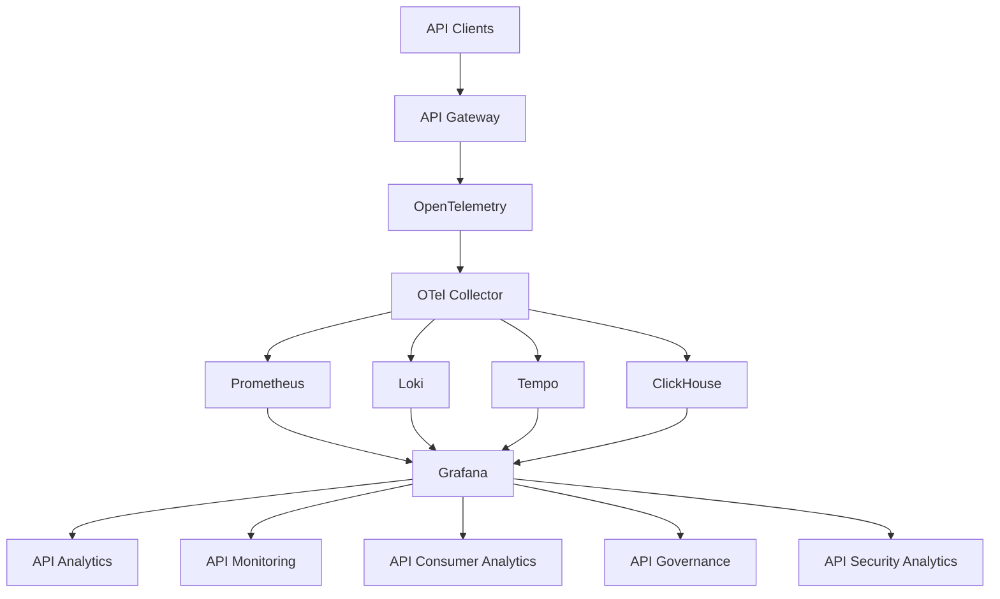

# Awesome-API-Analytics

# 📊 Top API Analytics & Open-Source API Observability


> A curated list of **API analytics platforms, API observability tools, API monitoring systems, API management analytics and open-source software** for understanding API traffic, performance, reliability, adoption, consumers and business usage.


API analytics sits between **API infrastructure, observability and product analytics**. Modern platforms can provide visibility into:


* API traffic

* Requests and responses

* Latency

* Errors

* Status codes

* API consumers

* Endpoints

* Usage trends

* API adoption

* Customer behavior

* Performance

* Distributed traces

* Logs

* Metrics

* Security events

* Governance

* API monetization

* Usage-based billing


This repository focuses primarily on **open-source and self-hostable alternatives** to commercial API analytics platforms such as Moesif, Treblle, Kong Konnect, Gravitee, Tyk Dashboard, Azure API Management Analytics, Google Apigee Analytics, Akita, SmartBear API Hub and Observe API.


A key distinction is that **API analytics is not necessarily the same thing as API management**.


```text

API Gateway

     │

     ▼

API Traffic

     │

     ├──────────────► Metrics

     │

     ├──────────────► Logs

     │

     ├──────────────► Traces

     │

     ├──────────────► User / Consumer Analytics

     │

     └──────────────► Business Analytics

                         │

                         ▼

                    API Analytics

```


The open-source ecosystem is particularly strong when API analytics is assembled from:


```text

OpenTelemetry

      +

Prometheus

      +

Grafana

      +

Loki

      +

Tempo / Jaeger

      +

ClickHouse / Elasticsearch

      +

Open-Source API Gateway

      =

Open-Source API Analytics Platform

```


---


## 📑 Table of Contents


* [☁️ SaaS/Hosted Platforms](#️-saashosted-platforms)

* [🌍 Open-Source](#-open-source)

* [🚪 Open-Source API Gateways](#-open-source-api-gateways)

* [📈 Open-Source API Analytics Platforms](#-open-source-api-analytics-platforms)

* [📡 OpenTelemetry API Observability](#-opentelemetry-api-observability)

* [📊 Open-Source Metrics & Dashboards](#-open-source-metrics--dashboards)

* [📝 Open-Source API Logging](#-open-source-api-logging)

* [🔍 Open-Source Distributed Tracing](#-open-source-distributed-tracing)

* [🗄️ Open-Source Analytics Databases](#️-open-source-analytics-databases)

* [🔎 Open-Source API Discovery](#-open-source-api-discovery)

* [🛡️ Open-Source API Security Analytics](#️-open-source-api-security-analytics)

* [💰 Open-Source API Monetization Analytics](#-open-source-api-monetization-analytics)

* [🧩 Commercial Platform → Open-Source Equivalent](#-commercial-platform--open-source-equivalent)

* [🏗️ API Analytics Architecture](#️-api-analytics-architecture)

* [🔄 Open-Source API Observability Architecture](#-open-source-api-observability-architecture)

* [📊 API Analytics Pipeline](#-api-analytics-pipeline)

* [👤 API Consumer Analytics](#-api-consumer-analytics)

* [⚖️ Commercial vs Open-Source](#️-commercial-vs-open-source)

* [🚀 Recommended Open-Source Stacks](#-recommended-open-source-stacks)

* [📈 API Analytics Metrics](#-api-analytics-metrics)

* [🎯 Recommended Projects by Use Case](#-recommended-projects-by-use-case)

* [🏢 Building a Moesif Alternative](#-building-a-moesif-alternative)

* [🌐 Open-Source API Analytics Landscape](#-open-source-api-analytics-landscape)

* [🧠 Why Open-Source API Analytics Matters](#-why-open-source-api-analytics-matters)

* [🤝 Contributing](#-contributing)

* [⚠️ Disclaimer](#️-disclaimer)


---


# ☁️ SaaS/Hosted Platforms


Commercial API analytics platforms combine traffic collection, dashboards, monitoring, consumer analytics, governance and sometimes API monetization.


| Platform                                                                              | Company        | Primary Focus                | Key Capabilities                                                                  |

| ------------------------------------------------------------------------------------- | -------------- | ---------------------------- | --------------------------------------------------------------------------------- |

| [Moesif](https://www.moesif.com/)                                                     | Moesif         | API analytics & monetization | API observability, user analytics, dashboards, monitoring and usage-based billing |

| [Treblle](https://treblle.com/)                                                       | Treblle        | API intelligence             | API monitoring, analytics, documentation, governance and security                 |

| [Kong Konnect](https://konghq.com/products/kong-konnect)                              | Kong           | API management analytics     | API health, performance, usage, consumers and centralized analytics               |

| [Gravitee](https://www.gravitee.io/)                                                  | Gravitee       | API management               | API analytics, dashboards, governance and API lifecycle management                |

| [Tyk Dashboard](https://tyk.io/)                                                      | Tyk            | API management analytics     | API analytics, gateway monitoring, usage and management                           |

| [Azure API Management Analytics](https://azure.microsoft.com/products/api-management) | Microsoft      | Enterprise API management    | API analytics, monitoring, metrics and Azure integration                          |

| [Google Apigee Analytics](https://cloud.google.com/apigee)                            | Google Cloud   | API analytics                | API traffic analytics, developer analytics, monetization and management           |

| [Akita](https://www.akitasoftware.com/)                                               | Akita Software | API observability            | API discovery, behavioral analysis and API monitoring                             |

| [SmartBear API Hub](https://smartbear.com/product/api-hub/)                           | SmartBear      | API lifecycle intelligence   | API catalog, governance, documentation and analytics                              |

| [Observe](https://www.observeinc.com/)                                                | Observe        | Data observability           | Logs, metrics, traces and operational analytics                                   |

| [Elastic](https://www.elastic.co/)                                                    | Elastic        | Observability                | Logs, metrics, traces, APM and analytics                                          |

| [Datadog](https://www.datadoghq.com/)                                                 | Datadog        | Observability                | API monitoring, APM, logs, traces and dashboards                                  |

| [New Relic](https://newrelic.com/)                                                    | New Relic      | APM / observability          | API monitoring, distributed tracing and analytics                                 |

| [Dynatrace](https://www.dynatrace.com/)                                               | Dynatrace      | Observability                | API monitoring, distributed traces and AI-assisted analytics                      |

| [Splunk](https://www.splunk.com/)                                                     | Splunk         | Observability / analytics    | Logs, metrics, traces and security analytics                                      |

| [Sentry](https://sentry.io/)                                                          | Sentry         | Application monitoring       | Errors, performance and API-related telemetry                                     |

| [Postman](https://www.postman.com/)                                                   | Postman        | API platform                 | API testing, monitoring, documentation and collaboration                          |


Moesif positions itself around API observability/analytics and API monetization, while Treblle combines monitoring, documentation, security analysis and error tracking.


Kong Konnect's Advanced Analytics provides centralized API health, performance and usage analytics, including request-level contextual information.


---


# 🌍 Open-Source


There is no single universally dominant open-source equivalent to Moesif or Apigee Analytics.


Instead, the open-source ecosystem is highly composable:


```text

                    OPEN-SOURCE API ANALYTICS

                              │

        ┌─────────────────────┼─────────────────────┐

        │                     │                     │

        ▼                     ▼                     ▼

   API Gateway          Telemetry Layer       Analytics Layer

        │                     │                     │

        ▼                     ▼                     ▼

     APISIX              OpenTelemetry          Grafana

     Kong OSS            OTel Collector         SigNoz

     Tyk OSS             Prometheus             Kibana

     Gravitee            Jaeger                 Custom UI

     Envoy               Loki

        │                     │

        └──────────┬──────────┘

                   ▼

             Analytics Data

                   │

          ┌────────┼────────┐

          ▼        ▼        ▼

       Metrics    Logs    Traces

          │        │        │

          └────────┼────────┘

                   ▼

             API Analytics

```


The strongest open-source strategy is generally to standardize telemetry with **OpenTelemetry**, then choose independent storage and visualization layers.


---


# 🚪 Open-Source API Gateways


API gateways are often the first place API analytics data is generated.


| Project                                                                 | Description              | Analytics Potential                                |

| ----------------------------------------------------------------------- | ------------------------ | -------------------------------------------------- |

| [Apache APISIX](https://github.com/apache/apisix)                       | Cloud-native API gateway | Metrics, logs, plugins and telemetry               |

| [Kong Gateway](https://github.com/Kong/kong)                            | Widely used API gateway  | Prometheus, OpenTelemetry and logging integrations |

| [Tyk Open Source](https://github.com/TykTechnologies/tyk)               | Go-based API gateway     | Metrics, analytics hooks and OpenTelemetry         |

| [Gravitee APIM](https://github.com/gravitee-io/gravitee-api-management) | API management platform  | API analytics and dashboards                       |

| [Envoy Proxy](https://github.com/envoyproxy/envoy)                      | High-performance proxy   | Metrics, access logs and distributed tracing       |

| [Traefik](https://github.com/traefik/traefik)                           | Cloud-native proxy       | Metrics, access logs and tracing                   |

| [NGINX](https://github.com/nginx/nginx)                                 | Web/API proxy            | Access logs and metrics                            |

| [HAProxy](https://github.com/haproxy/haproxy)                           | High-performance proxy   | Statistics and logs                                |

| [Apache APISIX Dashboard](https://github.com/apache/apisix-dashboard)   | APISIX management UI     | Gateway management                                 |

| [KrakenD Community Edition](https://github.com/krakendio/krakend-ce)    | API gateway / aggregator | Gateway metrics and telemetry                      |

| [Gloo Gateway](https://github.com/solo-io/gloo)                         | Kubernetes API gateway   | Metrics and observability                          |


Tyk has an example architecture integrating its open-source gateway with OpenTelemetry, Jaeger, Prometheus and Grafana to create an API observability dashboard.


---


# 📈 Open-Source API Analytics Platforms


## Grafana


[Grafana](https://github.com/grafana/grafana) is one of the most flexible open-source visualization platforms for API analytics.


It can visualize:


* Request rate

* Latency

* Error rate

* Status codes

* API endpoints

* Consumers

* Infrastructure metrics

* Business metrics


Grafana itself is primarily a visualization layer, so it is normally paired with data sources such as Prometheus, Loki, Tempo, Elasticsearch or ClickHouse.


---


## SigNoz


[SigNoz](https://github.com/SigNoz/signoz) provides an OpenTelemetry-native observability platform covering:


* Metrics

* Logs

* Distributed traces

* Dashboards

* Alerts

* Service performance


It is particularly interesting as a self-hosted alternative for teams wanting something closer to an **all-in-one API observability platform**.


---


## WSO2 API Manager


[WSO2 API Manager](https://github.com/wso2/product-apim) provides a broad open-source API management platform with:


* API gateways

* Developer portals

* API lifecycle management

* Analytics

* Security

* Governance


It is particularly relevant when API analytics needs to be part of a larger API management platform.


---


## Apache APISIX


[Apache APISIX](https://github.com/apache/apisix) can serve as the traffic collection and policy layer for a self-hosted API analytics architecture.


Typical architecture:


```text

APISIX

  │

  ├── Access Logs

  ├── Metrics

  ├── Traces

  └── OpenTelemetry

          │

          ▼

    Analytics Backend

          │

          ▼

       Grafana

```


---


## Gravitee


[Gravitee APIM](https://github.com/gravitee-io/gravitee-api-management) combines API management with analytics and dashboarding.


Its dashboard supports API and application metrics, health information and configurable analytics visualizations.


---


# 📡 OpenTelemetry API Observability


[OpenTelemetry](https://github.com/open-telemetry/opentelemetry-collector) is arguably the most important building block for an open-source API analytics architecture.


It provides vendor-neutral collection and transport of:


```text

Metrics

   +

Logs

   +

Traces

   +

Profiles

```


For API analytics:


```text

API Gateway

     │

     ▼

OpenTelemetry SDK / Instrumentation

     │

     ▼

OpenTelemetry Collector

     │

 ┌───┼───────────────┐

 ▼   ▼               ▼

Metrics Logs       Traces

 │     │             │

 ▼     ▼             ▼

Prometheus Loki    Tempo/Jaeger

 │     │             │

 └─────┼─────────────┘

       ▼

    Grafana

```


---


# 📊 Open-Source Metrics & Dashboards


| Project                                                               | Primary Role                                   |

| --------------------------------------------------------------------- | ---------------------------------------------- |

| [Prometheus](https://github.com/prometheus/prometheus)                | Metrics collection and time-series database    |

| [Grafana](https://github.com/grafana/grafana)                         | Dashboards and visualization                   |

| [VictoriaMetrics](https://github.com/VictoriaMetrics/VictoriaMetrics) | High-performance metrics database              |

| [Mimir](https://github.com/grafana/mimir)                             | Scalable Prometheus-compatible metrics backend |

| [InfluxDB](https://github.com/influxdata/influxdb)                    | Time-series database                           |

| [OpenSearch](https://github.com/opensearch-project/OpenSearch)        | Search and analytics                           |

| [Kibana](https://github.com/elastic/kibana)                           | Elasticsearch visualization                    |

| [SigNoz](https://github.com/SigNoz/signoz)                            | Unified observability                          |


Prometheus + Grafana remains one of the simplest open-source combinations for API traffic and performance dashboards.


---


# 📝 Open-Source API Logging


API logs are essential for understanding individual requests.


| Project                                                                              | Role                          |

| ------------------------------------------------------------------------------------ | ----------------------------- |

| [Grafana Loki](https://github.com/grafana/loki)                                      | Log aggregation               |

| [OpenSearch](https://github.com/opensearch-project/OpenSearch)                       | Searchable logs and analytics |

| [Elasticsearch](https://github.com/elastic/elasticsearch)                            | Search and log analytics      |

| [Fluent Bit](https://github.com/fluent/fluent-bit)                                   | Log collection                |

| [Vector](https://github.com/vectordotdev/vector)                                     | Log and telemetry pipeline    |

| [OpenTelemetry Collector](https://github.com/open-telemetry/opentelemetry-collector) | Telemetry collection          |

| [Apache Kafka](https://github.com/apache/kafka)                                      | Event streaming               |


Typical pipeline:


```text

API Gateway

    │

    ▼

Access Logs

    │

    ▼

Fluent Bit / OTel

    │

    ▼

Kafka / Collector

    │

    ▼

Loki / OpenSearch

    │

    ▼

Grafana / OpenSearch Dashboards

```


---


# 🔍 Open-Source Distributed Tracing


Distributed tracing provides request-level visibility across microservices.


| Project                                            | Description                 |

| -------------------------------------------------- | --------------------------- |

| [Jaeger](https://github.com/jaegertracing/jaeger)  | Distributed tracing         |

| [Grafana Tempo](https://github.com/grafana/tempo)  | High-scale tracing backend  |

| [Zipkin](https://github.com/openzipkin/zipkin)     | Distributed tracing         |

| [OpenTelemetry](https://github.com/open-telemetry) | Telemetry standard and SDKs |

| [SigNoz](https://github.com/SigNoz/signoz)         | Traces + metrics + logs     |


Jaeger focuses on distributed traces, while Grafana is primarily oriented toward visualization of metrics and other telemetry; combining them provides complementary observability.


---


# 🗄️ Open-Source Analytics Databases


For large API estates, the telemetry backend becomes a major architectural decision.


| Database                                                              | Strength                            |

| --------------------------------------------------------------------- | ----------------------------------- |

| [ClickHouse](https://github.com/ClickHouse/ClickHouse)                | High-performance analytical queries |

| [OpenSearch](https://github.com/opensearch-project/OpenSearch)        | Search + analytics                  |

| [Elasticsearch](https://github.com/elastic/elasticsearch)             | Logs and analytics                  |

| [PostgreSQL](https://github.com/postgres/postgres)                    | General-purpose analytics           |

| [TimescaleDB](https://github.com/timescale/timescaledb)               | Time-series PostgreSQL              |

| [VictoriaMetrics](https://github.com/VictoriaMetrics/VictoriaMetrics) | Metrics at scale                    |

| [Apache Druid](https://github.com/apache/druid)                       | Real-time analytics                 |

| [Apache Pinot](https://github.com/apache/pinot)                       | Low-latency analytics               |

| [Apache Doris](https://github.com/apache/doris)                       | Analytical database                 |

| [DuckDB](https://github.com/duckdb/duckdb)                            | Embedded analytical SQL             |


For high-volume API event analytics, **ClickHouse** is especially interesting because API requests can be represented as analytical events and queried across dimensions such as endpoint, consumer, status, geography and latency.


---


# 🔎 Open-Source API Discovery


API analytics can also become a source of **API inventory and discovery**.


Useful projects and building blocks include:


| Project                                                            | Role                               |

| ------------------------------------------------------------------ | ---------------------------------- |

| [Akita](https://www.akitasoftware.com/)                            | API behavioral discovery           |

| [Backstage](https://github.com/backstage/backstage)                | Developer portal / service catalog |

| [OpenAPI](https://github.com/OAI/OpenAPI-Specification)            | API specification                  |

| [Kong](https://github.com/Kong/kong)                               | Gateway-level API inventory        |

| [Apache APISIX](https://github.com/apache/apisix)                  | Gateway inventory                  |

| [Gravitee](https://github.com/gravitee-io/gravitee-api-management) | API lifecycle management           |

| [Tyk](https://github.com/TykTechnologies/tyk)                      | Gateway and API management         |


API discovery can be modeled as:


```text

Observed Traffic

      │

      ▼

Endpoint Discovery

      │

      ▼

Schema Inference

      │

      ▼

API Inventory

      │

      ▼

Ownership / Governance

      │

      ▼

API Catalog

```


---


# 🛡️ Open-Source API Security Analytics


API analytics can feed security systems.


```text

API Requests

     │

     ▼

Telemetry

     │

 ┌───┼────────────┐

 ▼   ▼            ▼

Rate  Identity   Payload

     │            │

     ▼            ▼

Behavior      Anomaly

Analysis      Detection

     │            │

     └─────┬──────┘

           ▼

       API Security

```


Useful components include:


| Project                                                             | Role                        |

| ------------------------------------------------------------------- | --------------------------- |

| [Coraza](https://github.com/corazawaf/coraza)                       | Open-source WAF engine      |

| [OWASP ModSecurity CRS](https://github.com/coreruleset/coreruleset) | WAF rules                   |

| [OpenTelemetry](https://github.com/open-telemetry)                  | Security telemetry          |

| [OpenSearch](https://github.com/opensearch-project/OpenSearch)      | Security analytics          |

| [Falco](https://github.com/falcosecurity/falco)                     | Runtime security            |

| [Suricata](https://github.com/OISF/suricata)                        | Network threat detection    |

| [Zeek](https://github.com/zeek/zeek)                                | Network security monitoring |


---


# 💰 Open-Source API Monetization Analytics


Commercial platforms such as Moesif extend API analytics into monetization.


An open-source implementation can be built from:


```text

API Requests

     │

     ▼

Usage Meter

     │

     ▼

Consumer / API / Endpoint

     │

     ▼

Aggregation

     │

     ▼

Billing Meter

     │

     ▼

Invoice

```


Useful building blocks:


| Project                                                                                  | Role                        |

| ---------------------------------------------------------------------------------------- | --------------------------- |

| [Moesif Open Source Developer Portal](https://github.com/Moesif/moesif-developer-portal) | Developer portal components |

| [Kill Bill](https://github.com/killbill/killbill)                                        | Billing platform            |

| [Lago](https://github.com/getlago/lago)                                                  | Usage-based billing         |

| [OpenMeter](https://github.com/openmeterio/openmeter)                                    | Usage metering              |

| [Formance](https://github.com/formancehq/stack)                                          | Financial ledger            |

| [Apache Kafka](https://github.com/apache/kafka)                                          | Usage event streaming       |

| [ClickHouse](https://github.com/ClickHouse/ClickHouse)                                   | Usage analytics             |


---


# 🧩 Commercial Platform → Open-Source Equivalent


| Commercial Platform                | Open-Source Equivalent / Building Blocks                 |

| ---------------------------------- | -------------------------------------------------------- |

| **Moesif**                         | OpenTelemetry + ClickHouse + Grafana + Prometheus + Loki |

| **Treblle**                        | OpenTelemetry + Grafana + OpenSearch + API gateway       |

| **Kong Konnect Analytics**         | Kong OSS + OpenTelemetry + Prometheus + Grafana          |

| **Gravitee Analytics**             | Gravitee OSS + OpenTelemetry + Grafana                   |

| **Tyk Dashboard**                  | Tyk OSS + OpenTelemetry + Prometheus + Grafana           |

| **Azure API Management Analytics** | APISIX / Kong / Tyk + OTel + Grafana                     |

| **Google Apigee Analytics**        | API gateway + OTel + ClickHouse + Grafana                |

| **Akita**                          | OpenTelemetry + API traffic analysis + schema discovery  |

| **SmartBear API Hub**              | Backstage + OpenAPI + OTel + Grafana                     |

| **Observe API**                    | OpenTelemetry + ClickHouse / OpenSearch + Grafana        |

| **Datadog API Monitoring**         | OTel + Prometheus + Loki + Tempo + Grafana               |

| **New Relic API Monitoring**       | OTel + SigNoz                                            |

| **Elastic API Analytics**          | Elasticsearch + Kibana + OTel                            |

| **Splunk API Analytics**           | OpenTelemetry + OpenSearch + Grafana                     |

| **API Analytics SaaS**             | OTel Collector + ClickHouse + Grafana                    |

| **API Observability Platform**     | OTel + Prometheus + Loki + Tempo                         |

| **API Monetization Analytics**     | OpenMeter + Lago + ClickHouse + Grafana                  |


---


# 🏗️ API Analytics Architecture


A complete API analytics system can be divided into:


```text

                         API CLIENTS

                             │

                             ▼

                       API GATEWAY

                             │

              ┌──────────────┼──────────────┐

              │              │              │

              ▼              ▼              ▼

           Metrics          Logs          Traces

              │              │              │

              └──────────────┼──────────────┘

                             ▼

                    OpenTelemetry

                         Collector

                             │

                ┌────────────┼────────────┐

                ▼            ▼            ▼

           Prometheus      Loki         Tempo

                │            │            │

                └────────────┼────────────┘

                             ▼

                          Grafana

                             │

          ┌──────────────────┼──────────────────┐

          ▼                  ▼                  ▼

      Operations          Product            Business

       Analytics          Analytics          Analytics

```


---


# 🔄 Open-Source API Observability Architecture





---


# 📊 API Analytics Pipeline


```text

                    API REQUEST

                         │

                         ▼

                  ┌─────────────┐

                  │ API Gateway │

                  └──────┬──────┘

                         │

                         ▼

                   Telemetry Event

                         │

            ┌────────────┼────────────┐

            ▼            ▼            ▼

          Metric         Log         Trace

            │            │            │

            └────────────┼────────────┘

                         ▼

                 OTel Collector

                         │

       ┌─────────────────┼─────────────────┐

       ▼                 ▼                 ▼

  Prometheus           Loki             Tempo

       │                 │                 │

       └─────────────────┼─────────────────┘

                         ▼

                      Grafana

                         │

              ┌──────────┼──────────┐

              ▼          ▼          ▼

           Runtime     Product    Business

           Analytics  Analytics   Analytics

```


---


# 👤 API Consumer Analytics


API analytics becomes significantly more valuable when requests are associated with a consumer.


Instead of simply measuring:


```text

GET /users

1,000,000 requests

```


you can measure:


```text

Customer A

    ├── 400,000 requests

    ├── 99.9% success

    ├── 120 ms p95

    └── $400 usage


Customer B

    ├── 250,000 requests

    ├── 98.7% success

    ├── 350 ms p95

    └── $250 usage

```


The analytics data model can therefore look like:


```text

API Request

    │

    ├── Timestamp

    ├── API

    ├── Endpoint

    ├── Method

    ├── Status

    ├── Latency

    ├── Consumer

    ├── Application

    ├── API Key

    ├── Region

    ├── User

    ├── Request Size

    ├── Response Size

    ├── Trace ID

    └── Cost

```


This allows analytics to move from **infrastructure monitoring** toward **API product analytics**.


---


# 📈 API Analytics Metrics


A mature API analytics platform should track:


| Category       | Metrics                         |

| -------------- | ------------------------------- |

| Traffic        | Requests, RPS, throughput       |

| Reliability    | Error rate, success rate        |

| Latency        | p50, p90, p95, p99              |

| HTTP           | 2xx, 3xx, 4xx, 5xx              |

| Endpoint       | Requests per endpoint           |

| Consumer       | Requests per customer           |

| Geography      | Region / country                |

| Application    | Requests per application        |

| Authentication | API key / OAuth / JWT usage     |

| Payload        | Request / response sizes        |

| Availability   | Uptime / health                 |

| Performance    | Latency distribution            |

| Errors         | Error categories                |

| Adoption       | Active consumers                |

| Retention      | Returning consumers             |

| Monetization   | Usage / revenue                 |

| Cost           | Infrastructure cost per request |

| Security       | Anomalies / suspicious traffic  |

| Governance     | Policy violations               |

| AI APIs        | Tokens / model / cost           |


---


# 📊 API Analytics Dashboard


A Moesif-like open-source dashboard could look conceptually like:


```text

┌───────────────────────────────────────────────────────┐

│                    API ANALYTICS                      │

├───────────────────────────────────────────────────────┤

│                                                       │

│  Requests       Errors       p95       Consumers      │

│  12.4M          1.2%        184ms       18,420        │

│                                                       │

├───────────────────────────────────────────────────────┤

│                  REQUEST VOLUME                       │

│                                                       │

│       ╭────╮                                          │

│   ╭───╯    ╰──╮                                       │

│ ──╯            ╰────────────────                      │

│                                                       │

├──────────────────────┬────────────────────────────────┤

│ Top APIs             │ Error Rate                     │

│                      │                                │

│ /users       4.2M    │ /payments       4.2%          │

│ /orders      3.1M    │ /users          0.8%          │

│ /payments    2.8M    │ /orders         0.4%          │

│                      │                                │

├──────────────────────┴────────────────────────────────┤

│                 TOP API CONSUMERS                     │

│                                                       │

│ Customer A      2.1M requests       99.9% success     │

│ Customer B      1.4M requests       99.7% success     │

│ Customer C      0.9M requests       98.9% success     │

└───────────────────────────────────────────────────────┘

```


---


# 🧠 API Analytics Data Model


A useful normalized schema:


```text

                    API Event

                       │

        ┌──────────────┼──────────────┐

        │              │              │

        ▼              ▼              ▼

      API           Consumer        Request

        │              │              │

        ▼              ▼              ▼

    Endpoint       Application      Response

        │              │              │

        └──────────────┼──────────────┘

                       ▼

                  Telemetry

                       │

       ┌───────────────┼───────────────┐

       ▼               ▼               ▼

     Metrics          Logs           Traces

       │               │               │

       └───────────────┼───────────────┘

                       ▼

                  Analytics DB

                       │

                       ▼

                    Dashboard

```


---


# ⚡ API Analytics + API Gateway


The gateway can act as the first instrumentation point:


```text

                     Internet

                        │

                        ▼

                 ┌─────────────┐

                 │ API Gateway │

                 └──────┬──────┘

                        │

          ┌─────────────┼─────────────┐

          ▼             ▼             ▼

       Routing       Security      Telemetry

          │             │             │

          └─────────────┼─────────────┘

                        ▼

                     Backend

```


This makes open-source gateways such as:


* Apache APISIX

* Kong

* Tyk

* Gravitee

* Envoy

* Traefik

* KrakenD


particularly valuable components of an API analytics platform.


---


# ⚖️ Commercial vs Open-Source


| Capability             | SaaS API Analytics  | Open-Source Stack        |

| ---------------------- | ------------------- | ------------------------ |

| Dashboards             | ✅                   | ✅                        |

| API Metrics            | ✅                   | ✅                        |

| Logs                   | ✅                   | ✅                        |

| Distributed Tracing    | ✅                   | ✅                        |

| API Consumer Analytics | ✅                   | ✅                        |

| Endpoint Analytics     | ✅                   | ✅                        |

| Custom Queries         | Varies              | ✅                        |

| Data Ownership         | Vendor-dependent    | ✅                        |

| Self Hosting           | Limited             | ✅                        |

| Air-Gapped             | Limited             | ✅                        |

| OpenTelemetry          | Increasingly common | ✅                        |

| API Gateway            | Often integrated    | Choose independently     |

| Database               | Managed             | Choose independently     |

| Visualization          | Integrated          | Grafana / Kibana etc.    |

| Alerts                 | ✅                   | ✅                        |

| API Discovery          | Varies              | Build / integrate        |

| API Monetization       | Some platforms      | Build / integrate        |

| Usage Billing          | Some platforms      | Lago / OpenMeter         |

| Infrastructure         | Managed             | Self-managed             |

| Scaling                | Managed             | Self-managed             |

| Vendor Lock-In         | Higher              | Lower                    |

| Customization          | Medium              | Very High                |

| Time to Deploy         | Fast                | Medium                   |

| Operational Complexity | Low                 | Higher                   |

| Cost at Scale          | Usage-dependent     | Infrastructure-dependent |


---


# 📊 Commercial Platform Architecture Comparison


| Platform          |    Analytics    | Observability | Consumer Analytics | Governance | Monetization |    Open Source    |

| ----------------- | :-------------: | :-----------: | :----------------: | :--------: | :----------: | :---------------: |

| Moesif            |        ✅        |       ✅       |          ✅         |      ✅     |       ✅      | Partial ecosystem |

| Treblle           |        ✅        |       ✅       |          ✅         |      ✅     |      ⚠️      |         No        |

| Kong Konnect      |        ✅        |       ✅       |          ✅         |      ✅     |      ⚠️      |    Gateway OSS    |

| Gravitee          |        ✅        |       ✅       |          ✅         |      ✅     |      ⚠️      |    OSS platform   |

| Tyk               |        ✅        |       ✅       |          ✅         |      ✅     |      ⚠️      |    Gateway OSS    |

| Azure APIM        |        ✅        |       ✅       |          ✅         |      ✅     |      ⚠️      |         No        |

| Google Apigee     |        ✅        |       ✅       |          ✅         |      ✅     |       ✅      |         No        |

| Akita             |        ✅        |       ✅       |          ✅         |      ✅     |       ❌      |         No        |

| SmartBear API Hub |        ✅        |       ⚠️      |          ✅         |      ✅     |       ❌      |         No        |

| Observe           |        ✅        |       ✅       |         ⚠️         |     ⚠️     |       ❌      |         No        |

| SigNoz            |        ✅        |       ✅       |         ⚠️         |     ⚠️     |       ❌      |         ✅         |

| Grafana           |        ✅        |       ✅       |         ⚠️         |     ⚠️     |       ❌      |         ✅         |

| OpenTelemetry     | Data collection |       ✅       |         ⚠️         |      ❌     |       ❌      |         ✅         |


---


# 🚀 Recommended Open-Source Stacks


## 🏆 1. General-Purpose API Analytics


```text

API Gateway

     +

OpenTelemetry Collector

     +

Prometheus

     +

Loki

     +

Tempo

     +

Grafana

```


Best general-purpose alternative to a basic API observability platform.


---


## ⚡ 2. High-Volume API Analytics


```text

API Gateway

     +

OpenTelemetry

     +

Kafka

     +

ClickHouse

     +

Grafana

```


Recommended when API events become too large for a simple metrics-only architecture.


---


## 🔍 3. API Observability Platform


```text

API Gateway

     +

OpenTelemetry

     +

SigNoz

```


This is one of the simplest ways to obtain an integrated self-hosted observability experience. SigNoz combines metrics, logs and distributed tracing around OpenTelemetry.


---


## 🛡️ 4. API Security Analytics


```text

API Gateway

     +

OpenTelemetry

     +

OpenSearch

     +

Grafana

     +

Coraza / WAF

     +

Suricata / Zeek

```


Best for teams combining API observability with security monitoring.


---


## 💰 5. API Monetization


```text

API Gateway

     │

     ▼

OpenTelemetry

     │

     ▼

Kafka

     │

     ▼

OpenMeter

     │

     ▼

Lago

     │

     ▼

Billing

```


This creates a self-hosted usage-metering and API monetization architecture.


---


## 🌐 6. Enterprise API Management


```text

Apache APISIX / Kong / Tyk / Gravitee

                  │

                  ▼

          OpenTelemetry

                  │

       ┌──────────┼──────────┐

       ▼          ▼          ▼

   Prometheus    Loki       Tempo

       │          │          │

       └──────────┼──────────┘

                  ▼

               Grafana

```


---


# 🏢 Building a Moesif Alternative


A self-hosted Moesif-style system can be decomposed into:


```text

                         API TRAFFIC

                              │

                              ▼

                         API GATEWAY

                              │

                              ▼

                      TELEMETRY AGENT

                              │

                              ▼

                    OpenTelemetry Collector

                              │

             ┌────────────────┼────────────────┐

             ▼                ▼                ▼

          Metrics            Logs            Traces

             │                │                │

             ▼                ▼                ▼

        Prometheus          Loki             Tempo

             │                │                │

             └────────────────┼────────────────┘

                              ▼

                         ClickHouse

                              │

                    ┌─────────┼─────────┐

                    ▼         ▼         ▼

                API Usage   Consumers  Revenue

                    │         │         │

                    └─────────┼─────────┘

                              ▼

                           Grafana

```


Moesif's own documentation emphasizes API analytics, user analytics, monitoring/alerts and API monetization, making this a useful conceptual decomposition for an open-source alternative.


---


# 🏗️ Building a Treblle Alternative


Treblle combines API monitoring with documentation, security analysis, governance and error tracking.


A comparable open architecture:


```text

                    API Gateway

                         │

                         ▼

                  OpenTelemetry

                         │

        ┌────────────────┼────────────────┐

        ▼                ▼                ▼

      Metrics           Logs            Traces

        │                │                │

        ▼                ▼                ▼

    Prometheus          Loki             Tempo

        │                │                │

        └────────────────┼────────────────┘

                         ▼

                       Grafana

                         │

       ┌─────────────────┼─────────────────┐

       ▼                 ▼                 ▼

   Monitoring        API Catalog       Governance

                         │

                         ▼

                    OpenAPI Specs

```


---


# 🔥 Building an Apigee Analytics Alternative


An enterprise API analytics architecture can be built as:


```text

                         API Gateway

                              │

                              ▼

                     OpenTelemetry

                              │

                              ▼

                       Kafka / OTel

                              │

                ┌─────────────┼─────────────┐

                ▼             ▼             ▼

            ClickHouse    Prometheus       Loki

                │             │             │

                └─────────────┼─────────────┘

                              ▼

                           Grafana

                              │

          ┌───────────────────┼───────────────────┐

          ▼                   ▼                   ▼

       Analytics          Governance          Security

          │                   │                   │

          ▼                   ▼                   ▼

       Consumers          API Catalog        Anomalies

```


---


# 🌐 Open-Source API Analytics Landscape


```mermaid id="p3x7y9"

mindmap

  root((API Analytics))

    API Gateways

      Apache APISIX

      Kong

      Tyk

      Gravitee

      Envoy

      Traefik

      KrakenD

      Gloo

    Telemetry

      OpenTelemetry

      OTel Collector

      Prometheus

    Metrics

      Prometheus

      VictoriaMetrics

      Mimir

      InfluxDB

    Logs

      Loki

      OpenSearch

      Elasticsearch

      Fluent Bit

      Vector

    Traces

      Jaeger

      Tempo

      Zipkin

    Analytics

      Grafana

      SigNoz

      OpenSearch Dashboards

      Kibana

    Databases

      ClickHouse

      OpenSearch

      Elasticsearch

      Pinot

      Druid

      Doris

    API Discovery

      Backstage

      OpenAPI

      Gateway Inventory

    Security

      Coraza

      OWASP CRS

      Suricata

      Zeek

      Falco

    Monetization

      OpenMeter

      Lago

      Kill Bill

      Kafka

    Applications

      API Monitoring

      API Analytics

      API Governance

      API Security

      API Discovery

      API Monetization

```


---


# 🧱 Open-Source API Analytics Reference Stack


```text

┌─────────────────────────────────────────────────────────┐

│                    API CLIENTS                           │

└─────────────────────────┬───────────────────────────────┘

                          │

┌─────────────────────────▼───────────────────────────────┐

│                    API GATEWAY                           │

│      APISIX / Kong / Tyk / Gravitee / Envoy             │

└─────────────────────────┬───────────────────────────────┘

                          │

┌─────────────────────────▼───────────────────────────────┐

│                OPENTELEMETRY COLLECTOR                   │

└───────────────┬─────────────────┬────────────────────────┘

                │                 │

        ┌───────▼───────┐ ┌───────▼────────┐

        │    Metrics    │ │ Logs / Traces  │

        └───────┬───────┘ └───────┬────────┘

                │                 │

          Prometheus       Loki / Tempo

                │                 │

                └────────┬────────┘

                         ▼

                   Analytics Layer

                         │

              ┌──────────┼──────────┐

              ▼          ▼          ▼

           Grafana     ClickHouse   SigNoz

              │          │          │

              └──────────┼──────────┘

                         ▼

                  API Intelligence

```


---


# 🧠 API Analytics vs API Observability


These concepts overlap but are not identical.


| Capability             | API Analytics | API Observability |

| ---------------------- | :-----------: | :---------------: |

| Request Volume         |       ✅       |         ✅         |

| Error Rate             |       ✅       |         ✅         |

| Latency                |       ✅       |         ✅         |

| Endpoint Analysis      |       ✅       |         ✅         |

| Consumer Analysis      |       ✅       |         ⚠️        |

| Business Metrics       |       ✅       |         ❌         |

| API Adoption           |       ✅       |         ⚠️        |

| Revenue                |       ✅       |         ❌         |

| Distributed Traces     |       ⚠️      |         ✅         |

| Infrastructure Metrics |       ❌       |         ✅         |

| Logs                   |       ⚠️      |         ✅         |

| Root Cause Analysis    |       ⚠️      |         ✅         |

| API Monetization       |       ✅       |         ❌         |

| Customer Behavior      |       ✅       |         ⚠️        |


The most powerful modern architecture combines both:


```text

                 API OBSERVABILITY

                        +

                 API ANALYTICS

                        │

                        ▼

              API INTELLIGENCE

```


---


# 🎯 Recommended Projects by Use Case


| Use Case                           | Recommended Starting Point              |

| ---------------------------------- | --------------------------------------- |

| Best open-source API observability | **OpenTelemetry + Grafana**             |

| All-in-one observability           | **SigNoz**                              |

| API metrics                        | **Prometheus + Grafana**                |

| API logs                           | **Loki + Grafana**                      |

| Distributed tracing                | **Tempo / Jaeger**                      |

| High-volume analytics              | **ClickHouse + Grafana**                |

| Searchable API logs                | **OpenSearch**                          |

| API gateway analytics              | **APISIX / Kong / Tyk / Gravitee**      |

| API management + analytics         | **WSO2 / Gravitee / APISIX ecosystem**  |

| API discovery                      | **Backstage + OpenAPI**                 |

| API security analytics             | **OpenTelemetry + OpenSearch + Coraza** |

| API monetization                   | **OpenMeter + Lago**                    |

| API event streaming                | **Kafka**                               |

| API telemetry pipeline             | **OpenTelemetry Collector**             |

| Enterprise dashboards              | **Grafana**                             |

| CPU-efficient metrics backend      | **VictoriaMetrics**                     |

| Large-scale traces                 | **Grafana Tempo**                       |

| Large-scale log analytics          | **Loki / OpenSearch**                   |

| Full self-hosted API analytics     | **OTel + ClickHouse + Grafana**         |


---


# 🔥 Recommended Production Architecture


For a serious API platform, a strong open-source architecture is:


```text

                    ┌───────────────────┐

                    │   API Consumers   │

                    └─────────┬─────────┘

                              │

                              ▼

                    ┌───────────────────┐

                    │    API Gateway    │

                    │ APISIX / Kong     │

                    │ Tyk / Gravitee    │

                    └─────────┬─────────┘

                              │

                              ▼

                    ┌───────────────────┐

                    │ OpenTelemetry     │

                    │ Collector         │

                    └─────────┬─────────┘

                              │

              ┌───────────────┼────────────────┐

              │               │                │

              ▼               ▼                ▼

         Prometheus          Loki             Tempo

              │               │                │

              └───────────────┼────────────────┘

                              ▼

                         ClickHouse

                              │

                ┌─────────────┼─────────────┐

                ▼             ▼             ▼

             Grafana       Analytics      Billing

                │             │             │

                ▼             ▼             ▼

             Dashboards    Consumers      OpenMeter

                              │

                              ▼

                            Lago

```


---


# 💡 API Analytics as an API Product Intelligence Layer


The ultimate goal is not simply to count requests.


A mature platform should answer questions such as:


```text

Which customers use our APIs the most?


Which APIs are growing fastest?


Which customers are experiencing elevated latency?


Which endpoint causes the most errors?


Which API versions are still actively used?


Which customers are approaching quotas?


Which APIs generate the most revenue?


Which customers have declining usage?


Which APIs are unused?


Which endpoints expose unusual traffic?


Which API calls cost us the most infrastructure?


Which customers are likely to churn?


Which APIs should be deprecated?

```


This transforms:


```text

API Logs

   ↓

API Metrics

   ↓

API Analytics

   ↓

API Intelligence

   ↓

API Product Management

```


---


# 🤝 Contributing


Contributions are welcome!


Please consider adding:


* Open-source API analytics platforms

* API observability projects

* API gateways

* OpenTelemetry integrations

* Metrics systems

* Log analytics systems

* Distributed tracing systems

* API discovery tools

* API governance projects

* API security analytics

* API monetization infrastructure

* Usage metering systems

* API dashboards

* Analytics databases

* API monitoring tools

* OpenAPI tooling

* API developer portals

* Self-hosted alternatives to commercial API analytics products


When adding a project, please distinguish between:


* **Fully open-source**

* **Open-core**

* **Source available**

* **Hosted open-source project**

* **Open-source gateway with proprietary analytics**

* **Commercial platform built on open-source infrastructure**


Do not label an entire commercial platform as open source merely because one of its components is open source.


---


# ⚠️ Disclaimer


This repository is an independent technical curation and is **not affiliated with or endorsed by any company or project listed here**.


API analytics and API observability are broad categories, and no single open-source project necessarily provides every capability offered by commercial platforms such as Moesif, Apigee or Kong Konnect.


A production-grade self-hosted platform may require several components:


```text

API Gateway

+

Telemetry

+

Metrics

+

Logs

+

Traces

+

Analytics Database

+

Dashboards

+

Alerting

+

API Catalog

+

Security

+

Billing

```


Open-source software also does not eliminate operational requirements. Organizations remain responsible for:


* Infrastructure

* Security

* Data retention

* Access control

* Privacy

* Compliance

* Scaling

* Backup

* Disaster recovery

* Monitoring

* Maintenance


Always verify the current license and deployment terms of each project before commercial use.


---


## ⭐ Star This Repository


If you are interested in:


* API Analytics

* API Observability

* API Management

* API Monitoring

* API Governance

* API Security

* API Discovery

* OpenTelemetry

* Developer Portals

* API Monetization

* Open-Source Infrastructure


consider giving this repository a ⭐ **Star** and contributing new projects.


---


**Last updated: September 2026**
